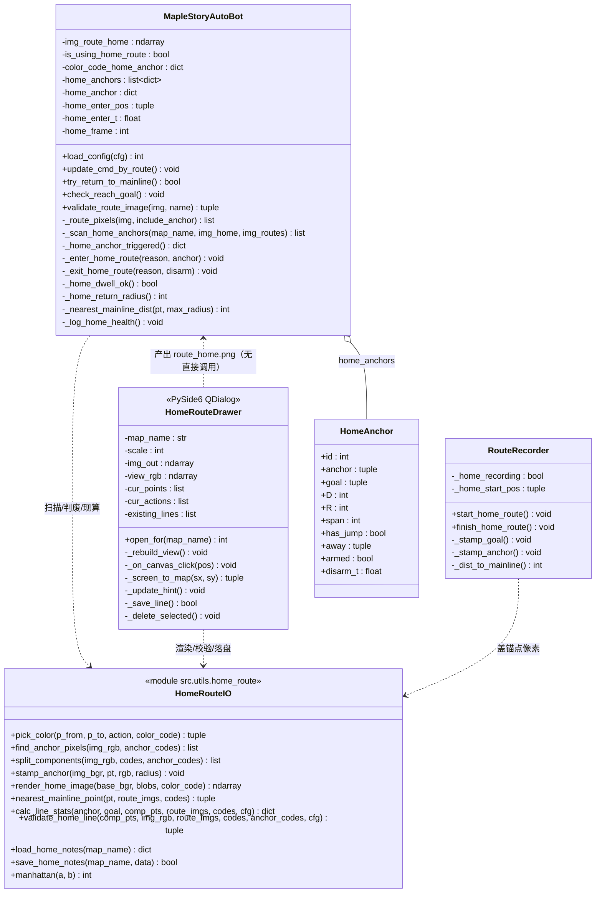
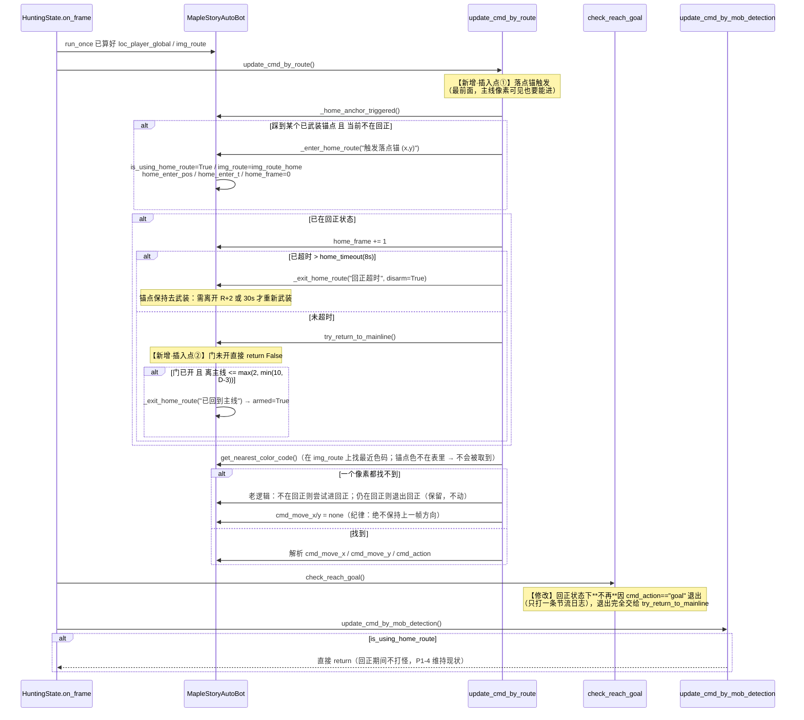
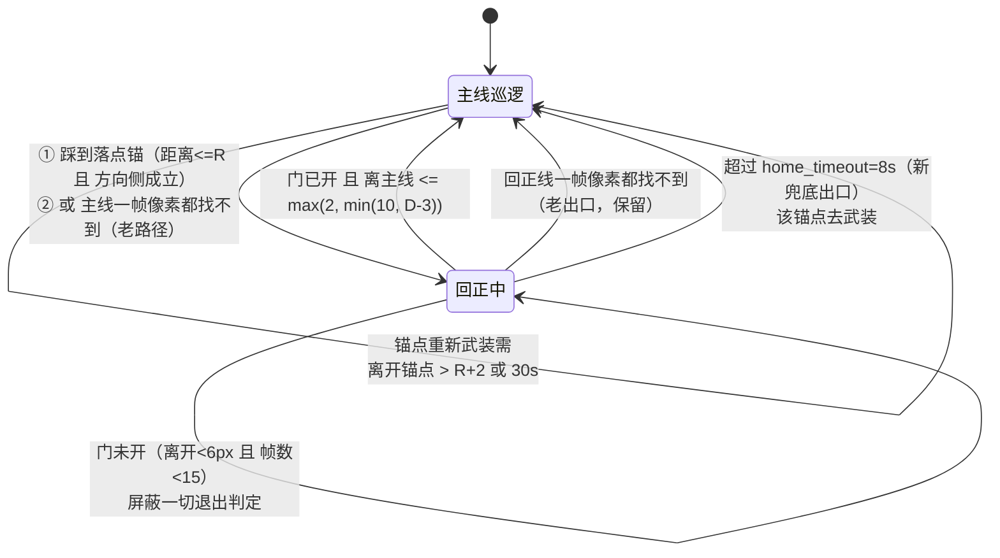
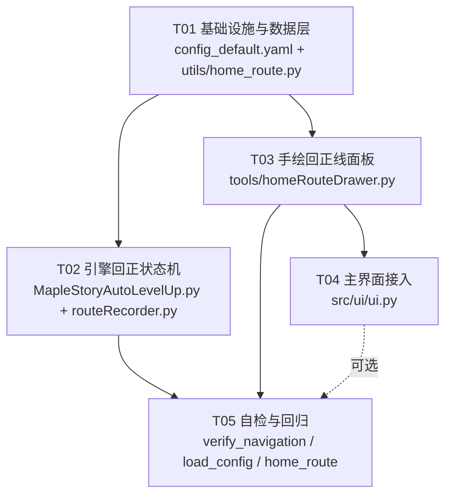

# 增量系统设计 ｜v0.9「手绘回正线」

- **版本**：v0.9（基于 v0.8，HEAD 177f88b）　**rev.2（2026-09-13 返工：Q2 改判，落点锚改存 PNG 色码）**
- **输入**：`docs/prd_v0.9_home_route.md`（Q1~Q10 按 PM 建议值采纳，Q2 由需求方/维护者**推翻**：改用 PNG 色码）
- **作者**：高见远（架构师）
- **原则**：**最小变更** —— 不动主线录制流程、不动打怪/索敌/看门狗；回正线只在"进入/退出"两处动刀。
- **Language**：中文（代码注释同）

> 行号均指 `177f88b` 版本的 `src/engine/MapleStoryAutoLevelUp.py`。

---

## rev.2 改了什么（相对 rev.1）

| rev.1 | rev.2 |
|---|---|
| 落点锚存 sidecar `route_home.json`，运行时必读 | **落点锚存 PNG 像素**（新增独立色码 `127,0,127`），`route_home.json` 降级为**引擎完全不读的可选备注** |
| json 与组件配对（anchor 坐标匹配） | 锚点像素**天然在连通域里**，配对这一层直接消失 |
| D / R / span 保存时算、落盘 | **加载时现算，不落盘**（不存就不漂移） |
| P2-1「缺 json 时从 PNG 反推」 | 删除 —— 现在压根不依赖 json，扫描锚点像素是**唯一且始终执行**的路径 |

**单一真源**：本项目的数据模型是「一张 PNG = 一条路线」。锚点色写在 PNG 上，就与路线**同生共死**：
改了图锚点跟着变、拷单文件不丢、`validate_*` 校验体系天然覆盖得到 —— 这是 json 方案做不到的。

---

## 0. 先说结论：本次到底改什么

| 坑 | 根因（读代码确认） | 本设计的解法 |
|---|---|---|
| 坑1 短掉落不触发 | `update_cmd_by_route:1870` 只有「主线**一帧像素都找不到**」才进回正；落点离主线 5~15px 时透过地板仍看得见主线 | 新增**落点锚触发**（与老条件取或），且**必须放在函数最前** |
| 坑2 判废误杀 | `validate_route_image:330/337` 要求 ≥20 像素 且 bbox 跨度 ≥10px；合法短回正线只有 8px | 回正线**不再复用**该校验，改 `src/utils/home_route.py` 里的**逐条组件判废**（抹掉废的那条，不连坐） |
| 坑3 抢跑 | `try_return_to_mainline:1679` 用 `home_return_range=20` 找主线，落点离主线 8px → 一进就出 | 加**最小驻留门** + **有效半径** `min(10, D-3)` |
| 坑4 退不出 | `check_reach_goal:2053` `reached = (cmd_action=="goal") or _near_seg_goal()`，而 `_near_seg_goal:1759` 在回正态直接 `return False`；只剩"踩到 goal 半径2px"一条路，且 `search_range=10 > 整条线长` 时**在落点就能取到 goal 像素** | 回正态的退出**完全不看 goal 像素**，只看「离主线够近」；再加 8s 超时出口 |

**一句话**：进入加「落点锚（PNG 色码）」，退出只看「离主线距离」，中途加「最小驻留门」，兜底加「8s 超时 + 锚点去武装」。

---

## Part A：系统设计

## 1. 实现方案与关键取舍

### 1.1 总体思路：把「回正线」从"一张图"升级为"图 + 加载期解析出的锚点"

v0.8 的回正线只有 `route_home.png` 一张图，引擎对它一无所知（不知道落点在哪、多长、有没有跳跃）——
所以只能靠"最近的像素"这种纯几何启发式，短线上必然失效。

v0.9 在 PNG 上引入 **落点锚像素**（独立色码 `127,0,127`）。引擎加载期：

```
读 route_home.png → 扫描锚点像素 → 8-连通域划分（一个组件 = 一条回正线，天然含 1 个锚点 + 1 个 goal）
                  → 每条现算 D / span / R / away → 逐条判废 → 抹掉废的那条 → 打中文体检报告
```

运行期触发判定就变成 O(1) 的坐标比较，不再依赖"看不看得到像素"这个不可靠信号。
**没有任何外部元数据文件参与运行**，不存在两份真源漂移的可能。

### 1.2 关键取舍逐条

| # | 取舍 | 选了 | 放弃了 | 理由 |
|---|---|---|---|---|
| 1 | **落点锚存哪儿（Q2 改判）** | **PNG 色码 `127,0,127`** | sidecar json | 判废规则只读 PNG 像素 → json 天然在校验体系之外；本项目的模型是「一张 PNG = 一条路线」，锚点必须跟路线同生共死（改图/拷图都不会漂） |
| 2 | 「一条回正线」怎么界定 | **PNG 上的 8-连通域**（一个组件 = 一条线） | json 里存点列 | 锚点像素**就在组件里**，配对/匹配这一层直接消失；**抹掉废线**= 把该组件涂黑，精确不误伤 |
| 3 | D / R / span 何时算 | **加载时现算，不落盘** | 保存时算并存 | 不存就不漂移；地图/主线一改，下次开跑自动重算 |
| 4 | 手绘器用什么 GUI | **PySide6 QDialog（主界面同进程）** | cv2 窗口 | PRD 6.2 要一排单选、列表、删除、红色提示；cv2 画这些是灾难。手绘不需要抓帧/游戏窗口，同进程反而省掉 QProcess 双向管道 |
| 5 | 进入回正的触发源 | **落点锚**（新）+ 「主线找不到像素」（老）**取或** | 只保留落点锚 | 老路径对"掉进没录过的坑/被撞飞出 40px"仍然有效，不能丢 |
| 6 | 退出回正的判据 | **只看离主线距离**（`min(10, D-3)`） | 踩到 goal 像素 | goal 圆点（半径2=13px）≥ 短线全长的一半，且在落点就能被 `search_range=10` 取到 → 必然"一进就出"。改成距离判据后，goal 只剩"标记 + 判废用" |
| 7 | 落点锚误触发怎么防 | **方向侧判据**（默认开）+ `R=min(8,D-3)` | 只靠 R | D-3 的余量只有 3px，撑不住小地图定位误差（±3px）。方向侧判据（角色必须落在"背离主线那一侧"）几乎零成本地消除主线上误触发 |
| 8 | 回正失败后怎么办 | **8s 超时退出 + 该锚点去武装**（重新武装需离开 `R+2` 或 30s） | 立刻重试 | 否则会变成「8s 回正（不打怪）→ 立刻重进」的死循环，正是"既不走也不打" |
| 9 | 手绘 goal / 锚点盖章半径 | **goal=1（5px）、锚点=0（1px）** | 沿用录制器的 goal=2（13px） | 13px 的黄点会吃掉 8px 短线的一大半，直接制造坑4。老录制器仍用 2（不影响，退出已不看 goal） |
| 10 | 是否新开模块 | **新开 `src/utils/home_route.py`**（纯函数） | 全塞进引擎 | 引擎和手绘器都要用「动作→颜色 / 组件划分 / 锚点扫描 / D·R 计算 / 重绘」；放公共模块才能"测的和跑的是同一份代码" |
| 11 | 是否动 `validate_route_image` | **不动**（主线继续用） | 加 `is_home` 参数 | 主线的三条判据（20 像素 / 跨度 10px）对主线是对的；混在一起只会互相污染 |
| 12 | 锚点色是否并入 `_route_pixels` | **默认不并**（`include_anchor=False`） | 全局并入 | 主线校验不能被锚点色污染；只有回正线校验显式传 `True`（见 3.5，两处调用点写死） |

### 1.3 技术难点与对策

1. **短回正线（5~10px）进入/退出都要能工作** —— 本设计所有阈值都写成 `min(配置值, 本条线的几何量)`：
   `R = max(3, min(8, D-3, span-2))`、退出半径 `= max(2, min(10, D-3))`。短线自动收紧，长线不受影响。
2. **一帧位移可能跨过整条回正线** —— 退出判据改成"离主线距离"后天然免疫（跨过 goal 时人已经贴着主线了）。
3. **`mask_route_colors` 会吃掉手绘像素**（`src/utils/common.py:954`：地图底图上出现路线色的位置，路线图上该像素会被涂黑）——
   - 加载期：**mask 前后各数一次锚点像素**，少了就打中文 ERROR（列出被吃掉的坐标 + 建议换色码）—— 把"127,0,127 不撞色"这个假设变成**每次开跑都自检**，而不是信一次实测；
   - 手绘保存后：**用引擎同一条链路回读校验**（load → mask → 检查落点/goal 像素是否存活），不存活就红字提示用户挪 1px。
4. **中文路径** —— 一律 `load_image` / `imwrite_unicode`（内部 `cv2.imdecode(np.fromfile(...))`），禁止裸 `cv2.imread/imwrite`。
5. **配置缺键** —— 所有新参数一律 `cfg.get("route", {}).get("home_xxx", 默认)`；`color_code_home_anchor` 缺失时回落到内置默认 `{"127,0,127": "none none anchor"}`。
6. **锚点色不能进 `color_code`** —— 否则角色站锚点上时 `get_nearest_color_code` 取到锚点 → 指令 `none none anchor` → 站着不动（新死局）。必须走**独立字典** `color_code_home_anchor`（仿 `color_code_up_down`）。

### 1.4 架构模式

沿用现有：**引擎保持"每帧无状态重算 + 少量跨帧标志"** 的风格。
本次新增的跨帧状态只有 7 个字段（见 3.3），全部集中在 `_enter_home_route / _exit_home_route` 两个出口里维护，
不允许散落到别处 —— 这是"加开关必须加出口"纪律的落地方式。

---

## 2. 文件列表（相对仓库根）

| # | 文件 | 性质 | 改什么 |
|---|---|---|---|
| 1 | `src/utils/home_route.py` | **新增** | 回正线领域层：动作→色码映射、**锚点像素扫描**、PNG 8-连通域划分、逐条判废、D/R/span/away 现算、整图重绘（删除某条用）、**可选备注文件**读写（手绘器专用）。纯函数、不依赖引擎/Qt，可离线测 |
| 2 | `src/engine/MapleStoryAutoLevelUp.py` | 修改 | ① `__init__` 增 7 个回正状态字段；② `load_config`：解析 `color_code_home_anchor`；回正线加载段（≈436-456）换成"扫锚点 → 分组件 → 现算 → 抹废线 → 体检报告"；**mask 三处调用补上锚点色**；③ `update_cmd_by_route`（1860）最前面插入落点锚触发 + 超时出口；④ `try_return_to_mainline`（1666）加驻留门 + 有效半径；⑤ `check_reach_goal`（2048）回正态不再用 goal 退出；⑥ `_route_pixels`（208）加 `include_anchor` 参数；⑦ 新增 8 个方法（见 3.5） |
| 3 | `tools/homeRouteDrawer.py` | **新增** | 手绘回正线面板（PySide6 QDialog）：4 倍画布、先选动作再点、实时 D/R 提示、撤销/清空/删除、保存（**盖锚点像素 + goal 像素**）+ 落盘回放校验。可 `python -m tools.homeRouteDrawer --new_map X` 单独跑 |
| 4 | `tools/routeRecorder.py` | 小改 | `start_home_route` 记下落点坐标 `_home_start_pos`；`finish_home_route` 收尾时**把落点涂成锚点色**（复用 `_stamp_goal` 的写法）—— 这样"老办法"录出来的图也带锚点，与手绘完全同构 |
| 5 | `src/ui/ui.py` | 小改 | ① 地图区按钮行（≈1085-1104）新增「🖊 手绘回正线（推荐）」（选中地图才可用）→ `_open_home_route_drawer()`；② `delete_selected_map` 清理清单带上可选备注文件 |
| 6 | `config/config_default.yaml` | 修改 | `route:` 段新增 `color_code_home_anchor` + 12 个回正参数；`route_recoder:` 段新增 5 个手绘参数（见第 6 节） |
| 7 | `tools/verify_navigation.py` | 修改 | 新增 ≥9 项（锚点触发/不误触发/判废/锚点色不污染主线/驻留/超时/去武装/多线隔离） |
| 8 | `tools/verify_load_config.py` | 修改 | 新增 1 项：新配置项齐全且 `home_timeout < watchdog.timeout` |
| 9 | `tools/verify_home_route.py` | **新增** | 手绘器纯函数自检：坐标换算（4x 点 (400,300)→(100,75)）、动作→颜色、锚点扫描、组件划分、中文路径读图 |
| 10 | `minimaps/<图>/route_home.png` | 数据 | **唯一真源**（含锚点像素） |
| 11 | `minimaps/<图>/route_home.json` | 数据·**可选** | 纯备注（名字/说明），**引擎运行时完全不读**（见 3.2） |

**不改**（明确排除）：`src/states/hunting.py`（调用顺序不动）、`src/utils/common.py`、任何打怪/索敌/看门狗代码、`validate_route_image` 本体、`color_code` / `color_code_up_down` 原表。

---

## 3. 数据结构与接口

### 3.1 回正线的 **PNG 像素编码规范**（唯一真源）

一条回正线 = `route_home.png` 上一个 **8-连通域**，由三类像素构成：

| 像素 | 颜色（RGB） | 来源 | 数量 |
|---|---|---|---|
| **落点锚** | `127,0,127`（配置 `route.color_code_home_anchor`） | 手绘：第 1 个点；录制器：F6 起头时站的位置 | 1 px（`home_draw_anchor_radius: 0`） |
| **段（动作）** | 走=红/蓝/灰/浅黄、跳=橙/青/洋红/青绿（`pick_color` 规则见 §10.4） | 相邻两点之间 `cv2.line(thickness=1)` | 线长 |
| **终点 goal** | `255,255,0`（沿用现有 goal 色） | 手绘保存 / 录制器收尾时盖章 | 手绘 5 px（r=1），录制器 13 px（r=2） |

```
例：落点(98,130) —跳— 终点(102,121)，span=9
    (98,130) = 127,0,127      ← 锚点（**最后**盖，压在段像素之上）
    (98,129)…(102,122) = 255,0,255 / 其它跳跃色   ← 段
    (102,121)±1 = 255,255,0   ← goal
```

**关键约束**
1. 锚点像素必须**最后**盖（像 `_stamp_goal` 那样压在段之上），否则会被同批线段覆盖。
2. 锚点色**只**出现在 `route_home.png`；主线 `route{N}.png` 上出现锚点色 = 用户画错，加载时按路线色一并 mask 掉（所以 415 行的 mask 也要传锚点色）。
3. `route_home.png` 允许有**多个互不相连的组件**（一张图多个坑），组件之间互不干扰。

### 3.2 可选的备注文件 `route_home.json`（**引擎不读**）

> 定位：**给人看的便利贴**。引擎、判废、触发全都不读它。删掉/漏拷/写错 → 一切照常。

```jsonc
{
  "version": 1,
  "notes": [
    { "anchor": [98, 130], "name": "左边坑", "note": "从最左边台子掉下去", "created_at": "2026-09-13 01:20:33" }
  ]
}
```
- 只有**手绘器**读写（在列表里显示"左边坑"这种名字）。
- 按 `anchor` 坐标关联；坐标对不上就忽略该条（不报错、不修复）。
- 手绘器保存时**不强制写**（用户不填名字就不写）。

### 3.3 引擎内的锚点对象（加载期现算，dict 形态）

```python
{
  "id": 1,
  "anchor": (98, 130),      # 锚点像素坐标 (x, y)
  "goal":   (102, 121),     # goal 像素质心
  "D": 9,                   # 锚点到最近主线像素的曼哈顿距离（加载时算）
  "R": 6,                   # = max(3, min(home_anchor_radius, D - home_anchor_clearance, span - 2))
  "span": 9,                # 锚点 → goal 的曼哈顿距离
  "has_jump": True,         # 组件内是否含跳跃类像素
  "away": (0, 8),           # anchor - nearest_mainline_point，方向侧判据用（加载时算一次）
  "armed": True,            # 运行期：是否可被触发
  "disarm_t": 0.0,          # 运行期：去武装时刻（超时兜底用）
}
```

### 3.4 引擎新增状态字段（`__init__`，紧跟 `self.is_using_home_route`）

```python
self.color_code_home_anchor = {}   # {(127,0,127): "none none anchor"} —— 独立字典，绝不能并进 color_code
self.home_anchors     = []      # list[dict]：加载期从 PNG 扫出的落点锚（已剔除废线）
self.home_anchor      = None    # 当前这次回正由哪个锚点触发（dict | None）
self.home_enter_pos   = None    # 进入回正时的角色全局坐标 (x,y)
self.home_enter_t     = 0.0     # 进入回正的时刻
self.home_frame       = 0       # 已处于回正状态的帧数
self.home_last_goal_log = 0.0   # 「踩到回正线终点」日志节流
```

### 3.5 类图（Mermaid）



### 3.6 关键函数签名

**`src/utils/home_route.py`（全部纯函数，便于离线自检）**

```python
def manhattan(a, b) -> int
def color_code_maps(cfg) -> tuple[dict, dict, dict]:
    """从 cfg['route'] 反查 {cmd: (R,G,B)} 三张表：color_code / color_code_up_down / color_code_home_anchor。"""

def pick_color(p_from, p_to, action, color_code) -> tuple[int, int, int]:
    """段动作 → RGB 色码（与录制器按键着色规则一致）：
       走  : |dx|>=|dy| → 红(left)/蓝(right)；否则 灰(up)/浅黄(down)
       跳  : |dx|>=|dy| → 橙(left+jump)/青(right+jump)；否则 dy<0 → 洋红(原地跳)，dy>0 → 青绿(down+jump)
       上  : 灰 127,127,127      下 : 浅黄 255,255,127        （本期不暴露 teleport）
       返回 RGB；画到 BGR 图时调用方负责 [::-1]。"""

def find_anchor_pixels(img_rgb, anchor_codes) -> list[tuple[int, int]]
def collect_pixels(img_rgb, codes, anchor_codes=None) -> list[tuple[int, int]]
def split_components(img_rgb, codes, anchor_codes) -> list[list[tuple[int, int]]]:
    """8-连通域划分（锚点色一并算作"线的一部分"）；一个组件 = 一条回正线。"""
def stamp_anchor(img_bgr, pt, rgb, radius=0) -> None
def nearest_mainline_point(pt, route_imgs, codes) -> tuple[int, int] | None
def nearest_mainline_dist(pt, route_imgs, codes, max_radius=None) -> int | None
def calc_line_stats(anchor, goal, comp_pts, route_imgs, codes, cfg) -> dict:
    """返回 {'D','R','span','has_jump','away'}；R = max(3, min(home_anchor_radius, D-clearance, span-2))。"""
def validate_home_line(comp_pts, img_rgb, route_imgs, codes, anchor_codes, cfg) -> tuple[bool, str]:
    """逐条判废（P0-5）。返回 (是否有效, 人话原因)。判据见 4.3。"""
def render_home_image(base_bgr, blobs, color_code) -> ndarray:
    """由"段 + 锚点 + goal"重绘整张 route_home.png（删除某条时用：重画除它之外的所有组件）。"""
def load_home_notes(map_name) -> dict        # 可选备注；失败返回 {}，永不报错
def save_home_notes(map_name, data) -> bool  # 原子写；可选
```

**`src/engine/MapleStoryAutoLevelUp.py`**

```python
# ── 修改（签名写死，两处调用点见下）────────────────────────────────
def _route_pixels(self, img, include_anchor: bool = False) -> list[tuple[int, int]]:
    """色码像素收集。include_anchor=False（默认）时**不含**锚点色 —— 主线校验不受污染。
       调用点：
         · include_anchor=False（默认，保持不变）：validate_route_image(324)、
           check_route_loop_closure(264)、_calc_seg_goals(1713)、_calc_pingpong_start(1803)
         · include_anchor=True（**仅**回正线校验/扫描）：_scan_home_anchors 内部
    """

# ── 新增 ────────────────────────────────────────────────────────────
def _scan_home_anchors(self, map_name, img_home_rgb, img_routes_rgb) -> list[dict]:
    """加载期：find_anchor_pixels → split_components → 每个组件配对它的锚点像素
       → calc_line_stats 现算 D/R/span/away → validate_home_line 逐条判废
       → **就地抹掉废线像素**（只涂黑该组件）→ mask 前后锚点数比对（被吃掉则 ERROR）
       → 返回可用锚点列表。"""

def _log_home_health(self) -> None:
    """P1-2：每条线打一行中文体检（落点坐标 / 离主线 D px / 触发半径 R px / 跨度 / 点数 / 是否含跳跃）。
       锚点从"文本"降级成"像素"后，这行日志是必须补回的可观测性。"""

def _home_anchor_triggered(self) -> dict | None:
    """运行期：是否踩到某个**已武装**锚点。命中条件（同时）：
       ① manhattan(角色, anchor) <= R
       ② 方向侧判据（home_anchor_direction_check 默认 true）：
          沿 away 方向的投影 proj >= -home_anchor_up_tol（默认 3px）
       ⚠️ 锚点色不在 color_code 里，角色站在锚点像素上时 nearest 取到的是相邻段像素（不会卡住）。
       命中即把该锚点 armed 置 False（边沿触发）。"""

def _enter_home_route(self, reason: str, anchor: dict | None = None) -> None
def _exit_home_route(self, reason: str, disarm: bool = False) -> None
def _home_dwell_ok(self) -> bool
def _home_return_radius(self) -> int
def _nearest_mainline_dist(self, pt, max_radius) -> int | None
```

**契约不变的修改**：`load_config`、`update_cmd_by_route`、`try_return_to_mainline`、`check_reach_goal`。

---

## 4. 程序调用流程

### 4.1 加载期（每次点「开始」都会重跑）

```mermaid
sequenceDiagram
    participant UI as 主界面/控制器
    participant Bot as MapleStoryAutoBot
    participant HR as utils.home_route
    participant FS as minimaps/&lt;图&gt;/

    UI->>Bot: load_config(cfg)
    Bot->>Bot: self.cfg = cfg（第一行，纪律）
    Bot->>Bot: 解析 color_code / color_code_up_down / **color_code_home_anchor**
    Bot->>FS: 读 route1..N.png
    Bot->>Bot: mask_route_colors ×3（color_code / up_down / **home_anchor**）
    Bot->>Bot: validate_route_image（主线三条判据，不动）
    Bot->>FS: 读 route_home.png（load_image，中文路径安全）
    Bot->>Bot: 数锚点像素 N_before
    Bot->>Bot: mask_route_colors ×3（同上，**锚点色必须一起传**）
    Bot->>Bot: 数锚点像素 N_after
    alt N_after < N_before
        Bot->>Bot: ERROR：N 个落点标记被地图底色吃掉了（列出坐标 + 建议换色码）
    end
    Bot->>HR: find_anchor_pixels + split_components(img_home)
    HR-->>Bot: [组件1(含锚点 A1), 组件2(含锚点 A2), ...]
    loop 每个组件
        Bot->>HR: calc_line_stats(A, goal质心, 组件, img_routes, cfg)
        HR-->>Bot: D / R / span / has_jump / away
        Bot->>HR: validate_home_line(...)
        HR-->>Bot: (ok, 人话原因)
        alt ok
            Bot->>Bot: 收进 home_anchors
        else 废
            Bot->>Bot: 把该组件像素涂黑（只涂这一条，其它线不受影响）
            Bot->>Bot: logger.error（症状 + 怎么改）
        end
    end
    alt 还有可用锚点
        Bot->>Bot: img_route_home = img_home
        Bot->>Bot: _log_home_health()（每条一行中文，含落点坐标）
    else 一条都不剩
        Bot->>Bot: img_route_home = None（等价于没有回正线）
    end
```

### 4.2 运行期：每帧 `hunting.on_frame`（顺序不动）



### 4.3 回正状态机（进入 / 驻留 / 退出）



**判废规则（P0-5，逐组件执行，全部满足才启用；全部量都在加载时现算）**

| # | 判据 | 默认 | 失败时的人话 |
|---|---|---|---|
| 1 | 组件内含**锚点像素**（`127,0,127`） | — | 「这条回正线没有落点标记 —— 老版本录的没有标记，请用【手绘回正线】重画一条（不用真掉下去），或【补录回正线】重录一次」 |
| 2 | 含 goal 像素 | — | 「这条回正线没有终点标记（黄点）—— 画到最后一点后点【保存】才会自动盖上」 |
| 3 | 至少一个位移/跳跃像素 | — | 「这条回正线一个动作像素都没有，等于没画」 |
| 4 | `span = 锚点→goal 曼哈顿` ≥ `home_min_return_span` | 5 | 「这条回正线的起点和终点只差 Npx —— 原地起头原地收尾。落点点在台子**下面**，终点点在**主线上**」 |
| 5 | `D = 锚点到最近主线像素` ≥ `home_anchor_min_clearance` | 6 | 「这条回正线的落点就画在主线上（离主线 Npx），等于没画 —— 请把落点点在台子下面」 |

只**警告**不判废：`goal` 到最近主线像素 > 15px → 「接驳点画偏了，走回去也接不上主线」。

> 实测校验：`minimaps/废都南方工地/route_home.png` = 20 像素、2 个组件（13px goal + 7px 移动）、
> 距主线 D = **0 和 2**、且**无锚点像素** → 命中判据 1 与 5 → **仍判废**，整图无可用线 →
> `img_route_home = None`，日志给中文人话。✅（这张图本来就是废线，本次迁移零损失）

---

## 5. 手绘器（tools/homeRouteDrawer.py）设计要点

1. **画布**：`map.png`（BGR）去色码后作底图，叠加主线 `route*.png` 色码像素（半透明）与已有 `route_home.png`
   （不透明；锚点像素额外画一个**靶心**图标便于辨认）。
   合成 → `QImage` → `QPixmap.scaled(w*f, h*f, FastTransformation)`；`QScrollArea` 里放**满尺寸** `QLabel`，
   鼠标事件坐标即画布坐标（无需补偿滚动偏移）。
2. **缩放**：默认 `f=4`（268×187 → 1072×748）；超出屏幕可用区降到 3；滚轮 3~6 整数档。
3. **坐标换算**：`x = int(round(sx / f))`，clamp 到 `[0, W-1]`。
   验收：`f=4, (400,300) → (100,75)` ✅（**禁止用 `//`**，会系统性偏 0.5px）
4. **交互**：一排单选（走 / 跳一下 / 爬上去 / 下去）→ 再点下一个点；第 1 点 = 落点；
   **保存时按序盖章：先 stamp goal（r=1）→ 再 stamp 锚点（r=0）**，锚点最后盖，压在段像素之上。
5. **实时反馈**：「落点(x,y) → 终点(x,y)，共 N 点 ｜ 离主线 D px · 触发半径 R px · 含 M 次跳跃 · ✓合格」；
   `D < 6` 红字「这里离主线太近了，请点在台子下面一点的落点上」。
6. **保存**：`img_out`（原图尺寸 BGR，只含真实落盘像素）= 已有 PNG 内容 + 本条新线 →
   `imwrite_unicode(route_home.png)` →（可选）写备注 json →
   **落盘回放校验**：走引擎同一条链路（load_image → cvtColor → mask_route_colors ×3）读回，
   确认本条的**锚点像素**与 goal 像素都还在；被底图吃掉就红字「这个点被地图底色吃掉了，请挪 1px 重画」。
7. **多线管理（纯 PNG，不需要任何元数据）**：启动时用 `split_components` 列出全部已有线，
   列表显示 `#1 落点(98,130) → 终点(102,121)，9px，跳 1 次`；
   **删除某条** = 把该组件像素涂黑后写回（或 `render_home_image` 重画其余组件）。
   Q7：与已有锚点间距 < 2R 时**警告不阻断**。
8. **不需要游戏窗口**：纯鼠标，游戏未启动也能用（PRD G1 / 验收 1）。

---

## 6. 新增配置项清单

`config/config_default.yaml` 的 `route:` 段（`home_return_range` 附近，≈204 行）：

| 键 | 默认 | 含义 | 谁会调 |
|---|---|---|---|
| `color_code_home_anchor` | `{"127,0,127": "none none anchor"}` | **落点锚专用色码（独立字典）**。绝不可并进 `color_code` | 基本不动 |
| `home_return_range` | **10**（原 20） | 回正期「已回主线」的**绝对上限**半径（Q6 从 20 收到 10） | 罕见 |
| `home_return_min` | 2 | 有效半径下限，防 `D` 太小时算成 0 | 不动 |
| `home_anchor_radius` | 8 | 落点触发半径默认上限 `R_default`（Q1） | 偶尔 |
| `home_anchor_clearance` | 3 | 安全余量：`R = max(3, min(R_default, D-3, span-2))`；退出半径 `= max(home_return_min, min(home_return_range, D-3))` | 偶尔 |
| `home_anchor_min_clearance` | 6 | 判废：锚点到主线 `D < 6` 判废 | 偶尔 |
| `home_min_return_span` | 5 | 判废：锚点→goal 跨度 < 5 判废 | 偶尔 |
| `home_min_leave` | 6 | 最小驻留：离开进入点 ≥ 6px（Q4） | 罕见 |
| `home_min_frames` | 15 | 最小驻留：已回正 ≥ 15 帧（Q4） | 罕见 |
| `home_timeout` | 8 | 回正超时（秒），**必须 < watchdog.timeout(10)**（Q5） | 罕见 |
| `home_anchor_direction_check` | **true** | 方向侧判据开关（P1-3 提到 P0，默认开） | 不动 |
| `home_anchor_up_tol` | 3 | 方向侧判据容差：允许角色在锚点"上方"（朝主线那侧）最多 3px | 不动 |
| `home_anchor_rearm_margin` | 2 | 去武装后重新武装需离开 `R + 2` px | 不动 |
| `home_anchor_rearm_timeout` | 30 | 去武装兜底：30s 后无条件重新武装（防永远不武装） | 不动 |

`route_recoder:` 段（手绘器 / 录制器专用）：

| 键 | 默认 | 含义 |
|---|---|---|
| `home_draw_scale` | 4 | 手绘画布默认放大倍数 |
| `home_draw_scale_min` | 3 | 滚轮下限 / 屏幕放不下时自动降级到的下限 |
| `home_draw_scale_max` | 6 | 滚轮上限 |
| `home_draw_goal_radius` | 1 | 手绘 goal 盖章半径（1 = 5px；录制器老流程仍是 2） |
| `home_draw_anchor_radius` | 0 | 落点锚盖章半径（0 = 单像素；短线像素紧张，1px 最省；想更醒目可调 1） |

> **纪律**：新键一律 `cfg.get("route", {}).get("home_xxx", 默认)`；`color_code_home_anchor` 缺失时回落内置默认。
> `_check_cfg_completeness`（169 行）会对老配置报缺键 ERROR —— 这是**预期行为**（提示配置过期），但绝不能崩。

---

## Part B：任务分解

### 7. 依赖包

**不新增任何第三方依赖**：`PySide6`、`numpy`、`opencv-python`、`PyYAML` 均已在用。

---

### 8. 任务列表（按实现顺序）

#### T01　基础设施与数据层　【P0】　依赖：无
**文件**：`config/config_default.yaml`（改）、`src/utils/home_route.py`（新增）

1. `config_default.yaml`：按第 6 节加齐 `color_code_home_anchor` + 13 个回正参数 + 5 个手绘参数（每项带中文注释）。
   锚点色那一项必须注释清楚「**独立字典，禁止并入 color_code**：否则角色站锚点上 nearest=锚点 → 指令 none → 卡住」。
2. `src/utils/home_route.py`：实现 3.6 全部纯函数
   - `manhattan` / `color_code_maps` / `pick_color`（含 `walk` 的 |dx| vs |dy| 分支）
   - `find_anchor_pixels` / `collect_pixels` / `split_components`（`cv2.connectedComponents(..., 8)`，**锚点色算作线的一部分**）
   - `stamp_anchor`（半径 0，单点；**必须最后盖**）
   - `nearest_mainline_point` / `nearest_mainline_dist` / `calc_line_stats`（现算 D/R/span/away）
   - `validate_home_line`（判据表见 4.3，文案照抄表内人话）
   - `render_home_image` / `load_home_notes` / `save_home_notes`（备注文件失败一律静默返回空）
3. **门禁**：`python -m tools.verify_load_config` 全绿（新增的【5】断言新键齐全 + `home_timeout < watchdog.timeout`）。

#### T02　引擎回正状态机（核心）　【P0】　依赖：T01
**文件**：`src/engine/MapleStoryAutoLevelUp.py`（改）、`tools/routeRecorder.py`（改）

1. `__init__`：加 3.4 的 7 个字段。
2. `load_config`：
   - 解析 `color_code_home_anchor`（独立字典，缺失回落默认）；
   - **415 / 442 行的 `mask_route_colors` 补第三次调用**（传 `color_code_home_anchor`）；
   - 回正线加载段换成 `_scan_home_anchors`（扫锚点 → 分组件 → 现算 → 判废 → 抹废线）；
   - **mask 前后各数一次锚点像素**，少了打中文 ERROR（列出坐标 + 建议换色码）；
   - 末尾 `_log_home_health()`；保留"文件不存在 / 文件在但判废"两种文案的区分。
3. `_route_pixels(img, include_anchor=False)`：默认行为与现在完全一致（4 处既有调用点不改）；
   只有 `_scan_home_anchors` 内部显式传 `True`。
4. 新增 8 个方法（3.6 签名）：`_scan_home_anchors` / `_log_home_health` / `_home_anchor_triggered` /
   `_enter_home_route` / `_exit_home_route` / `_home_dwell_ok` / `_home_return_radius` / `_nearest_mainline_dist`。
5. `update_cmd_by_route`：**最前面**插落点锚触发（插入点①）；回正分支里加帧计数 + 8s 超时出口（插入点②）。
   老的"找不到像素就进/出回正"逻辑原样保留，只是进出改走统一入口。
6. `try_return_to_mainline`：开头 `if not self._home_dwell_ok(): return False`；半径改 `_home_return_radius()`；
   命中后走 `_exit_home_route("已回到主线")`。
7. `check_reach_goal`：回正状态下**不再**因 `cmd_action=="goal"` 退出（只打节流日志）。
8. `routeRecorder.py`：`start_home_route` 记 `_home_start_pos`；`finish_home_route` 里**新增 `_stamp_anchor()`**
   （仿 `_stamp_goal`，色取 `color_code_home_anchor`，在 goal 之后盖）—— 让"老办法"产出的图与手绘同构。
9. **纪律检查**：不得改动段终点判定 / 方向感知 / 边沿触发 / `_near_seg_goal`；不得动打怪与看门狗；
   锚点色绝不可写进 `color_code`。

#### T03　手绘回正线面板　【P0】　依赖：T01
**文件**：`tools/homeRouteDrawer.py`（新增）

按第 5 节实现 PySide6 对话框：4x 画布 + QScrollArea、动作单选排、撤销/清空/删除列表、实时 D/R 提示、
保存（**先 goal 后锚点**盖章）+ 落盘回放校验（mask ×3）、`--new_map` 命令行入口可单独跑。
**门禁**：`python -m tools.verify_home_route` 全绿（坐标换算 (400,300)→(100,75)、动作→颜色、锚点扫描、组件划分、中文路径）。

#### T04　主界面接入　【P1】　依赖：T03
**文件**：`src/ui/ui.py`（改）

1. 地图区按钮行（≈1085-1104）加「🖊 手绘回正线（推荐）」，跟随 `_update_delete_btn` 的选中态启用/禁用；
   tooltip 写明"不用开游戏、不用掉下去"。
2. `_open_home_route_drawer()`：取 `self.selected_map` → 校验 `minimaps/<图>/map.png` 存在 → 实例化 drawer 并 `exec()` → 保存成功后 `append_log` 一行中文。
3. `delete_selected_map` 清理清单补上可选备注文件 `route_home.json`。

#### T05　自检与回归　【P0】　依赖：T02、T03
**文件**：`tools/verify_navigation.py`、`tools/verify_load_config.py`、`tools/verify_home_route.py`

Stub 需补 `color_code_home_anchor` / `home_anchors` 等新字段，并把 `_home_anchor_triggered` 等新方法挂上（挂**引擎真实方法**）。

| # | 用例 | 期望 |
|---|---|---|
| 1 | 角色站锚点（D=8、主线像素**可见**） | 进入回正（日志含「触发落点锚」） |
| 2 | 角色在主线上巡逻、距锚点 6px（R=5 且方向侧不通过） | **不**进入回正 |
| 3 | 合法短线：8px + 1 跳跃 + 锚点像素 + goal（D=9） | 判有效并加载 |
| 4 | 真实废线：`废都南方工地`（20px / 2 组件 / D=0,2 / **无锚点**） | 判废，`img_route_home=None` |
| 5 | 一图 2 条线、其中 1 条 D=0 | 只禁用那 1 条，另 1 条锚点仍可用 |
| 6 | 进入回正后 15 帧内（主线在 8px 内） | 不退出（最小驻留） |
| 7 | 一帧位移 12px 跨过 goal | 由「离开落点 + 离主线 ≤ min(10, D-3)」正常退出 |
| 8 | 回正 8s 接不上 | 超时退出 + 打怪接管 + 该锚点去武装（下一帧不立刻重进） |
| 9 | 锚点色不污染主线：主线图里放几个 `127,0,127` 像素 | `validate_route_image` 与 `_calc_seg_goals` 结果不变 |
| 10 | 角色站在锚点像素正上方 | `get_nearest_color_code` 取到相邻**段**像素（不是 none）→ 不卡住 |
| 11 | 中文路径 `废都南方工地` 走完整 `load_config` | 无异常，主线 2 段正常加载 |

`verify_load_config` 新增【5】。收尾三件套全绿：`verify_navigation`（≥25 项）、`verify_load_config`（≥5 项）、`verify_home_route`。

---

### 9. 任务依赖图



---

## 10. 共享知识（跨文件约定，工程师必读）

1. **单一真源**：`route_home.png` 是回正线的**唯一真源**（含锚点像素）。`route_home.json` 只是给人看的备注，
   **引擎运行时一律不读**。任何"从 json 读落点/判废/算 R"的写法都是 bug。
2. **坐标系**：一切落点/终点/角色位置都是**小地图全局坐标 (x, y)**，与 `map.png` / `route*.png` 像素 1:1。
   手绘画布 = 原图 × f；反算一律 `int(round(屏幕坐标 / f))` 并 clamp —— **禁止用整除 `//`**。
3. **颜色空间**：PNG 落盘 **BGR**（cv2），`config.route.*color_code*` 的键是 **RGB**。
   引擎统一 `cv2.cvtColor(load_image(p), cv2.COLOR_BGR2RGB)` 后比对；手绘器/录制器画之前必须 `color[::-1]`。
4. **锚点色三不准**：① 不准并入 `color_code`；② 不准出现在主线 `route{N}.png` 上（出现即按路线色 mask 掉）；
   ③ 不准被 `get_nearest_color_code` 取到（它在独立字典里，天然满足）。
5. **盖章顺序**：段 → goal → **锚点（最后）**。锚点先盖会被同批线段覆盖。
6. **`_route_pixels(img, include_anchor=False)`**：默认不含锚点（主线校验零污染）；
   只有回正线扫描/判废显式传 `True`。**调用点已在 3.6 写死，不要新增含糊用法。**
7. **mask 三连**：加载任何路线图/回正线图都要 `mask_route_colors` 三次
   （`color_code` / `color_code_up_down` / **`color_code_home_anchor`**）；手绘器的落盘回放校验同样三次。
8. **判废粒度 = 8-连通域**：一个组件一条线；废线 = 把**该组件**像素涂黑，其它线不受影响。
9. **动作→颜色映射**（`pick_color`）：`walk`：`|dx|>=|dy|` → 红/蓝，否则 灰/浅黄；
   `jump`：`|dx|>=|dy|` → 橙/青，否则 洋红(向上)/青绿(向下)；`up` → 灰；`down` → 浅黄。本期不画 teleport / stop。
10. **回正状态的唯一入口/出口**：进 = `_enter_home_route`，出 = `_exit_home_route`。禁止在别处直接写 `is_using_home_route`。
11. **退出优先级**：最小驻留门 → 离主线距离 → 一帧像素找不到 → 8s 超时。**`cmd_action=="goal"` 不再是回正退出条件**。
12. **中文路径**：读 `load_image`、写 `imwrite_unicode`。禁止裸 `cv2.imread / cv2.imwrite`（中文路径静默失败，已踩过的坑）。
13. **配置读取**：`cfg.get("route", {}).get("home_xxx", 默认)`。禁止 `cfg["route"]["home_xxx"]`。
14. **日志**：每条 = 「症状 + 怎么改」。锚点降级成像素后，加载期必须逐条打印落点坐标（可观测性补回）。
15. **改导航逻辑前先离线模拟**：`tools/verify_navigation.py` 的 Stub 挂引擎真实方法，不要另写假逻辑。
16. **边界速查**：`search_range=10` / `rescue_range=40` / `home_return_range=10` / `home_timeout=8` / `watchdog.timeout=10`（8 < 10，超时出口一定先于看门狗）。
17. **实测基线**（已核实，别重复量）：小地图 268×187；主线 route1/route2 各 21 像素、bbox 跨度 12px；
    `废都南方工地/route_home.png` = 20 像素 / 2 组件 / D=0 与 2 / bbox x[96,102] y[120,126]；
    `127,0,127` 不在现有任何色码表里（与 `255,0,127` / `127,0,255` 均不冲突）。

---

## 11. 已决策事项（维护者 2026-09-13 拍板）

| # | 决策 | 说明 |
|---|---|---|
| ① | **Q2 改判：落点锚存 PNG 色码 `127,0,127`，不存 json** | 需求方推翻 json 方案：判废只读 PNG → json 天然在校验体系外 → 两份真源必然漂移。本项目模型是「一张 PNG = 一条路线」，锚点必须跟路线同生共死 |
| ② | **退出半径 = `max(2, min(home_return_range, D-3))`** | Q6 的 10px 在 D=8 时于落点处即成立，门一开就误退；长线 D≥13 时恒等于 10，与 Q6 一致 |
| ③ | **方向侧判据提到 P0，默认 `home_anchor_direction_check: true`** | 3px 余量撑不住定位误差；方向判据能防"主线上巡逻经过落点上方"误触发，正是需求方最担心的 |
| ④ | **锚点去武装 / 重新武装** | 超时/接不上退出后保持去武装（需离开 `R+2` 或 30s）；成功退出立刻重新武装。否则 8s 超时 + 立刻重进 = 死循环 |
| ⑤ | **`cmd_action=="goal"` 不再是回正退出条件** | goal 圆点 13px ≥ 短线一半，站落点就能被 `search_range=10` 取到，必然一进就出。退出只看离主线距离 |
| ⑥ | **`_route_pixels(img, include_anchor=False)`** | 默认不含锚点（主线校验零污染），回正线校验显式传 `True` |
| ⑦ | **D / R / span 加载时现算，不落盘** | 不存就不漂移 |

---

## 12. 待明确事项（未决，需 PM / 维护者确认）

| # | 事项 | 我的建议 | 影响 |
|---|---|---|---|
| 1 | **`127,0,127` 的撞色假设要变成运行时自检**：维护者实测 `废都南方工地/map.png` 里该色出现 0 次，但换图/换地图可能撞色（`mask_route_colors` 会把锚点像素涂黑 → 锚点凭空消失） | 采纳维护者方案并**加强**：加载期 mask 前后各数一次锚点像素，少了就 ERROR 列出坐标 + 建议换色码。**不需要一次性实测背书** | 换图时的健壮性 |
| 2 | **老图迁移**：v0.9 之前录的 `route_home.png` **没有锚点像素** → 会被判废（判据 1），需要重录或用【手绘回正线】重画一次 | 接受。现网唯一一条回正线本来就是废线（D=0/2），**迁移零损失**；并在判废日志里写清"怎么补救"。同时 T02 给录制器加 `_stamp_anchor()`，新录的自动带锚点 | 只有存量老图受影响 |
| 3 | **R 额外受 `span-2` 约束**（防回正成功后站在 goal 上又被同一锚点触发），PRD 只有 `R=min(8, D-3)` | 采纳；极端短线（span=5）R 压到下限 3px，触发率下降 —— 这是"防横跳"的代价 | 极短线触发灵敏度 |
| 4 | **回正期间若爬楼梯/绳子**：角色爬梯经过落点锚时可能误触发（本设计**没有**加 `is_on_ladder` 例外） | 本期不加（最小变更），上线后观察；若出现"爬梯被打断"再补 | 潜在误触发 |
| 5 | **手绘器用 PySide6 同进程对话框**（不是 cv2 窗口、不是录制器子进程） | 采纳（PRD 那套单选/列表/红字提示用 cv2 画不现实） | 与主界面耦合，需确认可接受 |
| 6 | **备注文件 `route_home.json` 按锚点坐标关联**，锚点一挪备注就成孤儿 | 接受（孤儿条目静默忽略，不报错、不自动修复）。引擎不读，影响面仅限手绘器列表显示 | 极小 |
| 7 | **本期不做**：手绘主线 P2-2、回正线预览动画 P2-3、手绘暴露 teleport、自动识别落点 | — | 范围 |

---

## 13. 验收对照（PRD 第 11 节闸门 → 本设计落点）

| 闸门 | 由谁保证 |
|---|---|
| 1 游戏未启动、纯鼠标 4x 画布画完并保存 ≤5 分钟 | T03（手绘器）+ T04（入口） |
| 2 废都南方工地：主线正常加载、废回正线仍被拦截并给中文原因 | T01（`validate_home_line` 判据 1/5）+ T02（加载期扫描）+ T05 用例 4/11 |
| 3 落点距主线 8px、主线可见 → 进回正 → jump → 回主线 → 退出，≥15 帧无抢跑无卡死 | T02（锚点触发 + 驻留门 + 有效半径）+ T05 用例 1/6/7 |
| 4 主线上巡逻经过落点上方不误进回正 | T02（方向侧判据）+ T05 用例 2 |
| 5 `verify_navigation` ≥25 项、`verify_load_config` ≥5 项全绿，中文路径全通过 | T05 |
| 6（新增）锚点从 PNG 扫出且日志可查；锚点色不污染主线 | T02 + T05 用例 9/10 |
