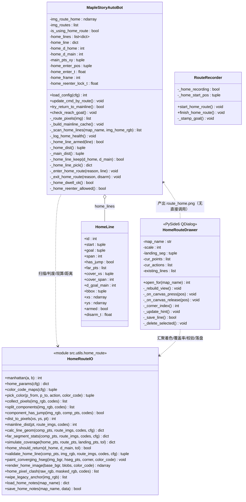
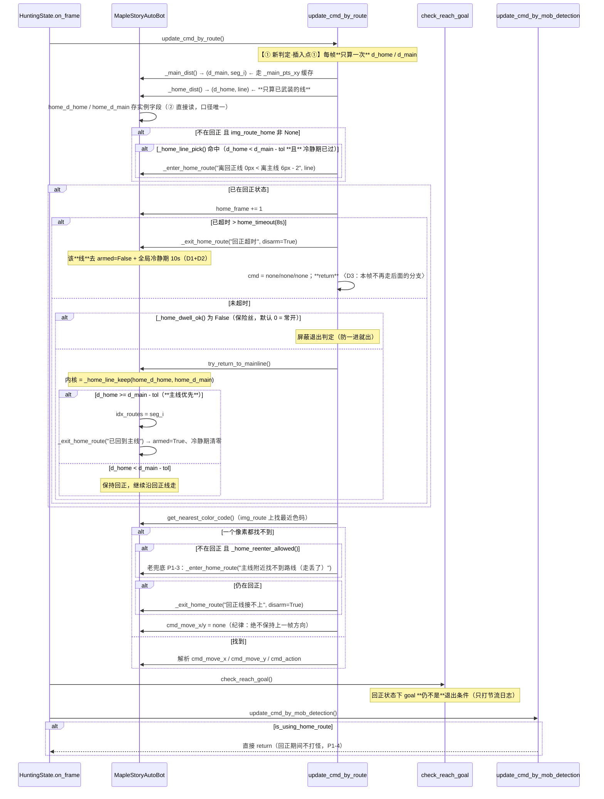
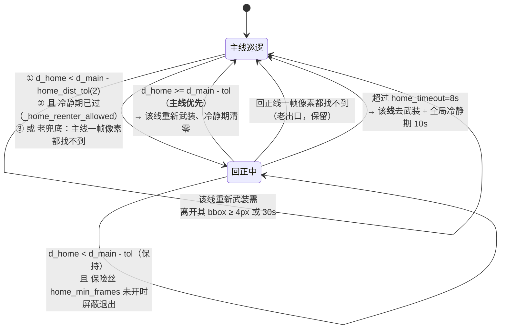
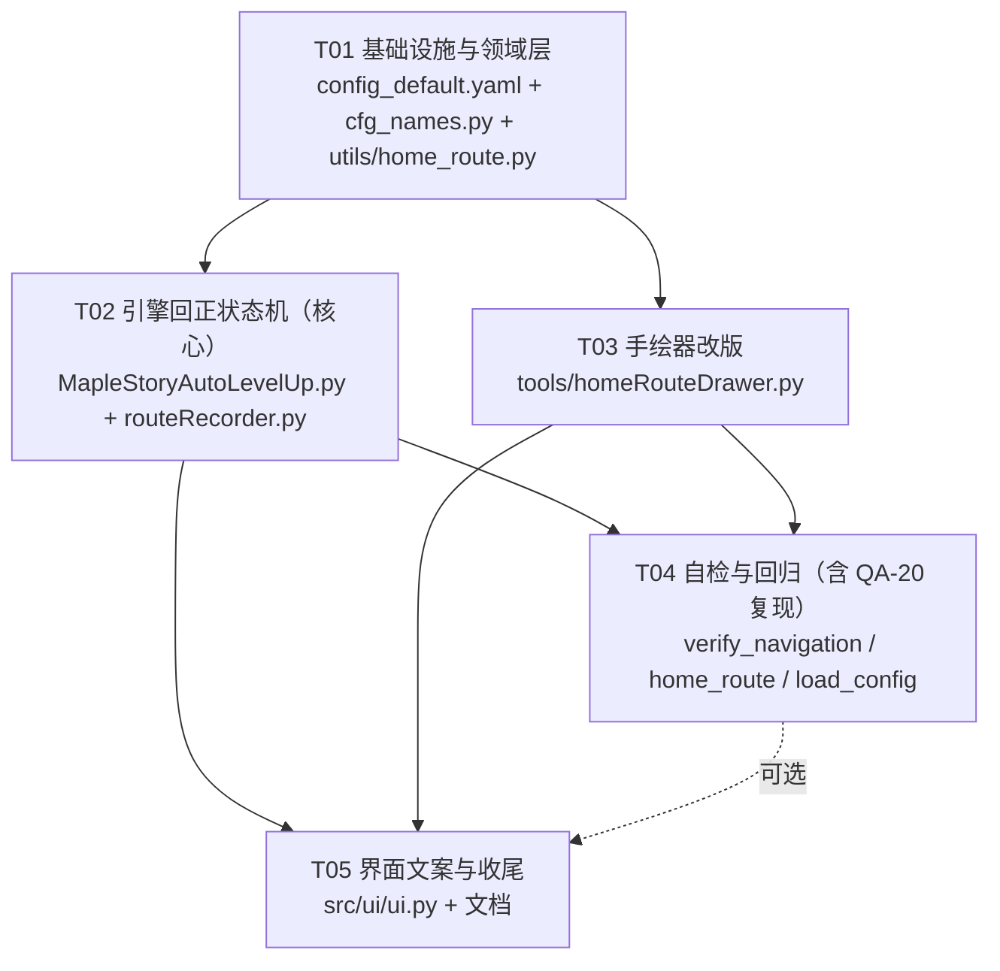

# 增量系统设计 ｜v0.9「回正线」**第二版：去掉落点锚，改比两条线的距离**

- **版本**：v0.9 rev.3（在 v0.9 第一版**已完工、501 项断言全绿、未 commit** 的基础上做**方案重构**）
- **输入**：`docs/prd_v0.9_home_route_v2.md`（权威）、`docs/prd_v0.9_home_route.md`（v1）、`docs/design_v0.9_home_route.md`（v1 设计）
- **作者**：高见远（架构师）
- **原则**：**最小变更 + 单一真源** —— 不动主线录制流程、不动打怪/索敌/看门狗；只有「回正的进入/保持/退出判据」这一处动刀，其余机制全部沿用。
- **语言**：中文（代码注释同）

> 行号指当前工作区（HEAD `177f88b` + v0.9 第一版未提交改动）的 `src/engine/MapleStoryAutoLevelUp.py`。

---

## 0. 一句话说清本次改什么

| | 第一版 | 第二版 |
|---|---|---|
| 概念 | 主线 / 回正线 / **落点锚**（3 个） | 主线 / 回正线（**2 个**） |
| 进入判据 | 角色踩进锚点半径 `R = max(3, min(8, D-3, span-2))` | **`d_home < d_main - tol`**（tol=2） |
| 主线上误触发 | 靠「方向侧判据 + R 收紧到 D-3」两个补丁 | `d_main = 0` 恒最小 → **天然不误触发**，补丁全删 |
| 退出判据 | 离主线 ≤ `max(2, min(10, D-3))` | **`d_home >= d_main - tol` → 主线优先**（走到终点两条线都是 0 → 自动退出） |
| 补丁数 | 4 个（方向侧 / R 收紧 / 驻留门 / 有效半径） | 0 个（驻留门降级为**默认关闭的保险丝**） |

**核心代码变化量**：引擎删 4 个方法、改 3 个方法；`home_route.py` 删 5 个函数、改 3 个、新增 5 个；
**唯一新增的运行期概念**：两个距离 `d_home` / `d_main` 和一条比较。

---

## Part A：系统设计

## 1. 实现方案与关键取舍

### 1.1 判定规则（维护者已拍板，直接采信）

```python
d_home = 角色 到「已武装的回正线」最近像素 的曼哈顿距离   # None = 没有可用回正线
d_main = 角色 到「主线 route{N}.png」最近像素 的曼哈顿距离 # None = 没有主线/没有主线像素

if d_home < d_main - tol:     进 / 保持回正状态，沿回正线走回主线
else:                         主线优先（继续巡逻，或退出回正）
```

- `tol = home_dist_tol = 2`（Q1 维护者已拍板）
- **相等（或 `d_home` 不小于 `d_main - tol`）时主线优先** —— 严格小于号天然实现「相等时主线优先」
- 距离一律**曼哈顿**（Q3，与 `search_range` / `rescue_range` 同度量）

### 1.2 为什么这条规则能一次性解决 v1 的坑 1（核心论证）

v1 的坑 1 根因是：`update_cmd_by_route` 用「`search_range=10` 内**有没有**主线像素」这个**布尔量**判断"人在不在主线上"。
坑底离主线只有 6px < 10 → 引擎"透过地板看得见主线" → 判定在主线上 → 永远不进回正。

新规则把布尔量换成**两条线的距离互相比较**：角色在坑底时 `d_home = 0`、`d_main = 6`，`0 < 4` 成立 → 进回正。
**与"看不看得见"完全无关**，所以不需要任何补丁。

> ⚠️ 因此 `d_home` / `d_main` 必须**全图最近像素**（不受 `search_range` / `rescue_range` 限制）。
> 复用 `get_nearest_color_code()` 的搜索框是**错误做法**（那就是坑 1 本身）。

### 1.3 反例硬约束：回正线必须 L 形（PRD 2.4）

只画竖线时，角色落坑右端 `(108,128)`：`d_home = 8`、`d_main = 8` → 相等 → 主线优先 → **接不住**。
→ 回正线起始段必须**沿坑底横着画，覆盖整个可能的落点区间**。这条由绘制器（P1-1 覆盖率）+ 引擎判废（判据④）两头守。

### 1.4 关键取舍逐条

| # | 取舍 | 选了 | 放弃了 | 理由 |
|---|---|---|---|---|
| 1 | 触发判据 | **两线距离比较** | 锚点半径 / 「不在主线上就回正」 | 前者是需求方要的"一句话"；后者会复活坑 1（PRD 2.2 已验证） |
| 2 | `d_home` 算哪些线 | **只算已武装的线** | 全算 + 单独判 armed | 去武装必须真的能"让这条线消失"，否则超时→立刻重进的死锁（见 §5）无解 |
| 3 | 退出判据 | **`d_home >= d_main - tol`** | `离主线 ≤ max(2,min(10,D-3))` | 后者是魔法数 + 依赖已删除的 D；前者与进入判据**同一个表达式**，口径唯一 |
| 4 | `try_return_to_mainline` | **保留外壳，换内核**（内部调新判据） | 删掉 | verify_navigation 的【8】【9】【10】用例语义（"附近找到主线就切回"）仍然成立；最小变更 |
| 5 | 每帧算几次距离 | **①算一次，存实例字段，②直接读** | 两处各算一次 | 一帧内出现"①说保持、②说退出"的口径分裂是最难查的 bug |
| 6 | L 形拐角怎么转向 | **横段汇聚编码**（Q9 裁决，绘制器逐像素着色） | 改成"有向路径"推进 | 引擎「最近像素法」**零改动**；成本全在绘制器 |
| 7 | 落点区间存哪儿 | **只在绘制器内存活，可写 `route_home.json` 备注**；**绝不写进 PNG** | PNG 上加第三种色码 | PNG 是唯一真源，加第三种色码 = 重走 v1 锚点的老路（撞色自检、mask 三连、误取指令） |
| 8 | 判废④「起始段覆盖」怎么判 | **起始段 x 跨度 ≥ 5**（不需要用户标注） | 与用户标注的落点区间比对 | 引擎加载期拿不到标注；而"只接得住 x=100 这一个点"这个症状用跨度就能判（验证见 §4.3） |
| 9 | 终点必须贴主线吗 | **判废**（`d_goal > tol` 就废） | 只警告 | 终点离主线 5px 时，角色站上去仍是 `0 < 5-2` → **永远出不来**，只能等 8s 超时（= v1 的 QA-18 洞）。留容差等于把洞原样保留 |
| 10 | `home_return_range` / `home_return_min` | **删除** | 保留（PRD 第 7 节写"保留"） | 新方案退出不用半径 → **没有消费者的配置项是死配置**（本项目"假开关"病）。需维护者复核，见 §12-① |
| 11 | 最小驻留门 | **保留配置项，默认 0（关闭）**（Q2 裁决） | 硬删 | 理论不需要；但竖段跳跃途中可能"跳到一半退出又掉回来"，实测若抖动就打开。不写死删 |
| 12 | 旧图上的 `127,0,127` 锚点像素 | **加载时涂黑 + 中文提示**（Q6 裁决） | 留着不管 | 该色不在 `color_code` 里 → 角色站上去 `get_nearest_color_code` 取不到 → 该帧无指令 → 站着不动 |

### 1.5 技术难点与对策

1. **每帧算两个"全图最近像素"不能慢** —— 268×187 全图 Python 双重循环 ≈ 50k 次/帧，30fps 下吃不消。
   → **load_config 时把主线像素、每条回正线的像素抽成 `np.int32` 坐标数组**，运行期用
   `np.min(np.abs(xs - px) + np.abs(ys - py))` 向量化算（主线 ~31 个点、回正线 ~21 个点，单次 < 20µs）。
   → 顺带：主线像素数组只在 `load_config` 里建一次（`img_routes` 运行期不变）。
2. **`d_home` 必须跳过未武装的线** —— 否则去武装形同虚设 → 超时死锁必然复活（§5 详述）。
3. **L 形拐角方向** —— 横段左右两半编码相反、都指向拐角（Q9 裁决），实现靠**逐像素着色**，见 §3.2。
4. **中文路径** —— 一律 `load_image` / `imwrite_unicode`（内部 `cv2.imdecode(np.fromfile(...))`）。
5. **配置缺键** —— 新键一律 `home_params(cfg)`（内置 `DEFAULT_HOME_PARAMS` 回落）；禁止 `cfg["route"]["home_xxx"]`。
6. **`self.cfg = cfg` 必须是 `load_config` 第一行**（既有纪律，不得破坏）。

### 1.6 架构模式

沿用：**引擎每帧无状态重算 + 少量跨帧标志**。
本次跨帧状态**不新增字段种类**（把 `home_anchors/home_anchor` 改名为 `home_lines/home_line`），
只在 `_enter_home_route` / `_exit_home_route` 两个出口里维护 —— 这是「加开关必须加出口」纪律的落地方式。

---

## 2. 文件列表（相对仓库根）

| # | 文件 | 性质 | 改什么 |
|---|---|---|---|
| 1 | `src/utils/home_route.py` | **改**（v1 新增的 803 行） | **删**：`find_anchor_pixels` / `stamp_anchor` / `calc_line_stats` 的 D·R·away 部分 / `home_return_radius` / `home_up_tol` / `anchor_color_clash` / `suggest_alt_anchor_color` / `DEFAULT_ANCHOR_*` / `render_home_image` 的 anchor 参数<br>**改**：`DEFAULT_HOME_PARAMS`（删 8 键、加 6 键）、`color_code_maps`（回到两张表）、`validate_home_line`（判据改版）、`split_components`（去掉 anchor 形参）<br>**新增**：`dist_to_pixels` / `mainline_dist` / `home_should_return` / `far_segment_stats` / `simulate_coverage` / `paint_converging_hseg` / `home_pixel_clash` / `wipe_legacy_anchor` / `LEGACY_ANCHOR_RGB` |
| 2 | `src/engine/MapleStoryAutoLevelUp.py` | 改 | ① `__init__`（114-130）：删 `color_code_home_anchor`，`home_anchors→home_lines`、`home_anchor→home_line`，新增 `home_d_home` / `home_d_main` / `_main_pts_xy`<br>② `load_config`（395-547）：删锚点色解析、删主线/回正线 mask 第三次调用、**新增旧锚点涂黑**、回正线加载段换 `_scan_home_lines`、撞色自检改数回正线像素、末尾建 `_main_pts_xy`<br>③ `_route_pixels`（233）：**去掉 `include_anchor` 形参**（4 处调用点恢复无参）<br>④ `try_return_to_mainline`（1757）：内核换新判据<br>⑤ `_scan_home_anchors→_scan_home_lines`（1806）、`_log_home_health`（1897）、`_home_anchor_armed→_home_line_armed`（1915）、`_home_anchor_triggered→_home_line_pick`（1940）<br>⑥ **删** `_home_return_radius`（2074）、`_home_reenter_allowed`（2088）保留并**上提到新入口**<br>⑦ 新增 `_home_dist` / `_main_dist` / `_home_line_keep`<br>⑧ `update_cmd_by_route`（2281）插入点①换新判定、插入点②不变<br>⑨ `check_reach_goal`（2537）文案更新 |
| 3 | `tools/homeRouteDrawer.py` | **改**（1327 行） | ① 删落点锚：掩膜/靶心/`_set_anchor`/`btn_set_anchor`/`away_text`/`make_blob.anchor`/`_save_note(anchor)`<br>② **新增落点区间蓝带**（按下-拖动-松开，`landing_seg`）<br>③ 画法改 L 形：拐角 = 第一个非 walk 段的起点；**横段逐像素汇聚着色**<br>④ 底部实时提示改「接住落点 N/M」，<100% 红字 + 保存灰掉（留「仍要保存」逃生口）<br>⑤ `audit_components` / `line_summary` / `verify_saved_image` / `save_gate_error` 全部改新字段<br>⑥ 落点区间可选写 `route_home.json` 备注 |
| 4 | `tools/routeRecorder.py` | 改（小） | **删** `_stamp_anchor()`（669-694）与 `finish_home_route` 里的调用（909）；`_home_start_pos` 只留作日志用（或不写锚点色）；面板提示文案去掉"落点标记" |
| 5 | `config/config_default.yaml` | 改 | `route:` 段：删 `color_code_home_anchor` + 7 个 `home_anchor_*` + `home_return_range`/`home_return_min`；**新增** `home_dist_tol` / `home_min_cover_span` / `home_cover_far_tol` / `home_goal_mainline_tol` / `home_rearm_margin` / `home_rearm_timeout`；改 `home_min_frames`/`home_min_leave` 默认 **0**；保留 `home_timeout: 8` / `home_reenter_lock: 10` / `home_min_return_span: 5`<br>`route_recoder:` 段：删 `home_draw_anchor_radius` |
| 6 | `src/utils/cfg_names.py` | 改（小） | 配置名中英对照表同步（删 9 项、加 6 项），否则界面下拉里会出现已删的键 |
| 7 | `tools/verify_navigation.py` | 改 | 【8】【9】【10】按新判据改写；【20】-【33】从"落点锚"改成"两线距离"；**新增 QA-20 死锁复现用例**（§5.4） |
| 8 | `tools/verify_home_route.py` | 改 | 全部用例换新判据；新增：PRD 2.3 六行验算 / 2.4 反例 / L 形三起点走通 / 起始段覆盖判废 / 终点贴主线判废 / 撞色自检新口径 |
| 9 | `tools/verify_load_config.py` | 改 | 断言新键齐全 + 旧锚点键**已消失** + `home_timeout < watchdog.timeout` + `home_dist_tol >= 0` |
| 10 | `src/ui/ui.py` | 改（小，可选 P1） | 「🖊 手绘回正线」按钮 tooltip 与录制面板文案去"落点锚"字样（验收闸门 9） |
| 11 | `minimaps/<图>/route_home.png` | 数据 | **唯一真源**（不再含锚点像素；L 形） |
| 12 | `minimaps/<图>/route_home.json` | 数据·可选 | 备注：名字 + **落点区间**（引擎**不读**） |

**不改（明确排除）**：`src/states/hunting.py`、`src/utils/common.py`、任何打怪/索敌/看门狗代码、
`validate_route_image`（主线判废）、`color_code` / `color_code_up_down` 两张色码表本体、主线录制流程（F3/F8/折返/闭环）。

---

## 3. 数据结构与接口

### 3.1 回正线的 PNG 像素编码规范（唯一真源，v2）

一条回正线 = `route_home.png` 上一个 **8-连通域**，由两类像素构成（**锚点像素彻底消失**）：

| 像素 | 颜色（RGB） | 来源 | 备注 |
|---|---|---|---|
| **段（动作）** | 走：红 `255,0,0`(左) / 蓝 `0,0,255`(右) / 灰 `127,127,127`(上) / 浅黄 `255,255,127`(下)<br>跳：橙 `255,127,0`(左跳) / 青 `0,255,255`(右跳) / 洋红 `255,0,255`(原地跳) / 青绿 `127,255,0`(下跳) | 相邻两点 `cv2.line(thickness=1)` + **逐像素汇聚着色**（横段） | 全部沿用现有 `route.color_code` |
| **终点 goal** | 黄 `255,255,0` | 手绘保存 / 录制器 `_stamp_goal` | 手绘 r=1（5px），录制器 r=2（13px） |

```
例：L 形回正线（废都南方工地）
    横段（沿坑底，拐角 x=99）：
      (94,128)…(98,128)  = 蓝 0,0,255    ← right（往右，走向拐角）
      (100,128)…(108,128) = 红 255,0,0   ← left （往左，走向拐角）
    竖段（拐角 → 主线）：
      (99,128)…(99,123)  = 洋红 255,0,255 ← jump（原地跳，6px 上平台）
      ⚠️ (99,128) 既是横段端点也是竖段起点 —— 由**竖段最后着色**，保证是 jump 色
    终点：
      (99,122)±1          = 黄 255,255,0  ← goal（盖在主线像素上）
```

**关键约束**
1. 盖章顺序：**段（横 → 竖）→ goal**。竖段在横段之后画，保证拐角像素是 jump 色。
2. **横段左右两半方向编码相反，都指向拐角**（Q9 裁决，写死，见 §3.2）。
3. `127,0,127` 不再出现在任何新图上；旧图残留的由加载期涂黑（§4.1）。
4. `route_home.png` 允许多个互不相连的组件（一张图多个坑），组件间互不干扰。

### 3.2 ★ 横段汇聚编码的实现约定（Q9 裁决，本次最关键的一条）

**问题**：L 形拐角处，若横段统一编码 `right`，角色落右端 `(105,128)` 会一直往右走到 `(108,128)`，**错过拐角**。

**裁决**：不改引擎核心算法（继续用「最近像素法」），改**绘制器**：横段按拐角位置自动分左右编码。

**实现（核心技巧：复用现有 `pick_color`，零新逻辑）**

```python
def paint_converging_hseg(img_bgr, hseg_pixels, corner, color_code, action="walk"):
    """横段**逐像素**着色：每个像素都用「从自己指向拐角」这个虚拟方向去选色。

        pick_color(p_from=(x, y), p_to=(corner_x, y), "walk")
            → dx = corner_x - x
            → dx > 0 → "right none none"（蓝，往右走向拐角）
            → dx < 0 → "left  none none"（红，往左走向拐角）
            → dx = 0 → 拐角本身，**跳过**（留给竖段着色）

    ⚠️ 禁止用 `cv2.line(整段, 单一颜色)` 画横段 —— 那样整条横段方向一致，
       角色落在拐角另一侧就会被推着走反、永远到不了拐角（就是 Q9 描述的 bug）。
    """
    for (x, y) in hseg_pixels:
        if x == corner[0]:
            continue                      # 拐角列：留给竖段
        rgb = pick_color((x, y), (corner[0], y), action, color_code)
        img_bgr[y, x] = (rgb[2], rgb[1], rgb[0])   # RGB → BGR
```

**引擎侧零改动**：`get_nearest_color_code()` 照旧取最近回正线像素 → 拿到 `right` / `left` / `jump`。

**拐角怎么定**（绘制器）：
```
corner_index = 第一个 action != "walk" 的段的下标（即用户切到「跳一下」的那个点）
corner       = points[corner_index]
横段像素     = polyline(points[0 .. corner_index]) 上的全部像素（cv2.line 采样）
竖段         = polyline(points[corner_index .. n-1])，逐段 pick_color(prev, cur, action)
```
用户全程只走（没跳跃）→ 没有拐角 → 整条按走向着色（不分段），判废时由「终点贴主线」和「起始段覆盖」兜。

**老录制器天然合规**：录制器是按角色**真实行走方向**着色的。角色从 `(105,128)` 走到 `(99,128)` 再跳，
录出来的横段编码天生就是 `left`（指向拐角）。所以汇聚编码**只对手绘有意义**，引擎不必区分来源。

### 3.3 回正线对象（加载期现算，dict）

```python
{
  "id": 1,
  "start":  (108, 128),      # 离主线**最远**的那个像素（≈ 坑底/落点区）
  "goal":   (99, 122),       # goal 像素质心
  "span":   15,              # start → goal 的曼哈顿距离（判废③）
  "has_jump": True,          # 组件内是否含跳跃类像素
  "n_pts":  21,
  "far_pts": [...],          # 起始段：d_main >= dmax - home_cover_far_tol 的那批像素
  "cover_xs":  (94, 108),    # 起始段的 x 范围（判废④）
  "cover_span": 15,          # cover_xs[1] - cover_xs[0] + 1
  "d_goal_main": 0,          # goal **像素集合**到主线的最小距离（判废⑤，用 min 不是质心）
  "bbox":   (94, 122, 108, 128),
  "xs": np.ndarray,          # 运行期算 d_home 用（x 坐标数组）
  "ys": np.ndarray,          # 运行期算 d_home 用（y 坐标数组）
  "armed": True,             # 运行期：这条线还能不能被选中
  "disarm_t": 0.0,           # 运行期：去武装时刻
}
```

### 3.4 引擎状态字段（`__init__` 114-130 改）

```python
self.home_lines = []        # list[dict]：加载期从 PNG 扫出的回正线（已剔废线）   ← 原 home_anchors
self.home_line  = None      # 当前这次回正走的是哪条线（dict | None）            ← 原 home_anchor
self.home_d_home = None     # 【新】本帧：到已武装回正线的最近距离（None = 量不出）
self.home_d_main = None     # 【新】本帧：到主线的最近距离（None = 量不出）
self._main_pts_xy = None    # 【新】(xs, ys) np.int32 数组，主线全部色码像素（load 时算一次）
self._main_pts_seg = None   # 【新】每个主线像素属于第几段（退出时切回正确段）
# 以下沿用 v1，语义不变：
self.home_enter_pos = None
self.home_enter_t   = 0.0
self.home_frame     = 0
self.home_reenter_lock_t = 0.0
self.home_last_goal_log  = 0.0
# 删除：
# self.color_code_home_anchor（连带 load_config 的解析、mask 第三次调用、_route_pixels 的 include_anchor）
```

### 3.5 类图



### 3.6 关键函数签名

**`src/utils/home_route.py`（纯函数，离线可测）**

```python
LEGACY_ANCHOR_RGB = (127, 0, 127)   # 仅供**旧图迁移**涂黑用，不是配置项、不进任何色码表

def manhattan(a, b) -> int

def home_params(cfg) -> dict:
    """取回正参数（缺键回落 DEFAULT_HOME_PARAMS）。禁止 cfg["route"]["home_xxx"]。"""

def color_code_maps(cfg) -> tuple[dict, dict]:
    """**回到两张表**：(color_code, color_code_up_down)。不再有第三张锚点表。"""

def pick_color(p_from, p_to, action, color_code) -> tuple[int, int, int]:
    """（**不改**）段动作 → RGB。横段汇聚着色直接复用它，见 paint_converging_hseg。"""

def collect_pixels(img_rgb, codes) -> list[tuple[int, int]]
def split_components(img_rgb, codes) -> list[list[tuple[int, int]]]:
    """8-连通域划分（**去掉 anchor_codes 形参**）；一个组件 = 一条回正线。"""

def dist_to_pixels(xs, ys, pt) -> int:
    """numpy 向量化的最近曼哈顿距离：np.min(np.abs(xs-px) + np.abs(ys-py))。
       xs/ys 为空 → 返回 None。"""

def mainline_dist(pt, route_imgs, codes) -> int | None
def nearest_mainline_point(pt, route_imgs, codes) -> tuple | None   # 保留（判废/警告用）

def calc_line_geom(comp_pts, route_imgs, codes, cfg, img_rgb=None) -> dict:
    """**替 calc_line_stats**。返回 {'start','goal','span','has_jump','n_pts','bbox'}。
       start = 组件里 d_main 最大的那个像素（≈ 坑底）；D / R / away 全部不再算。"""

def far_segment_stats(comp_pts, route_imgs, codes, cfg) -> dict:
    """起始段（离主线最远那一批像素）的覆盖范围。
       dmax = max(d_main(p))；far_pts = {p | d_main(p) >= dmax - home_cover_far_tol(2)}
       返回 {'far_pts','cover_xs','cover_span'}。
       🔬 已验算：L 形（横段 x94..108 y128 + 竖段 x99）→ far_pts = 整条横段，cover_span = 15 ✅
                  只画竖线（x=100, y123..128）→ far_pts = {y126,127,128}，cover_span = 1 ✅ 判废"""

def simulate_coverage(home_pts, route_pts, landing_pts, tol=2) -> dict:
    """P1-1 覆盖率模拟（**绘制器与自检共用**）：对落点区间每个像素跑一遍
       `d_home < d_main - tol`。返回 {'total','covered','missed': [(x,y)...]}。
       🔬 已验算：L 形 → 15/15；只画竖线 → 1/15 ≈ 7%（与 PRD 6.3 文案一致）✅"""

def home_should_return(d_home, d_main, tol) -> bool:
    """**新判定的唯一实现**（进入/保持共用，口径唯一）：
       d_home 或 d_main 为 None → False（量不出来就不进回正，交给老兜底 P1-3）
       return d_home < d_main - tol        # 严格小于 ⇒ 相等时主线优先"""

def validate_home_line(comp_pts, img_rgb, route_imgs, codes, cfg) -> tuple[bool, str]:
    """逐条判废（新判据见 §4.3）。返回 (是否有效, 人话原因)。"""

def paint_converging_hseg(img_bgr, hseg_pts, corner, color_code, action="walk") -> None:
    """★ 横段逐像素汇聚着色（见 §3.2）。禁止整段单色 cv2.line。"""

def render_home_image(base_bgr, blobs, color_code, goal_radius=1) -> np.ndarray:
    """重绘整张 route_home.png（删除某条时重画其余）。**去掉 anchor 相关参数与逻辑**。"""

def home_pixel_clash(raw_rgb, masked_rgb, codes) -> list:
    """撞色自检（**替 anchor_color_clash**）：mask 前后各数一次**回正线像素总数**，
       返回被地图底色吃掉的坐标。"""

def wipe_legacy_anchor(img_rgb) -> list:
    """Q6：把旧图上的 127,0,127 像素涂黑，返回被清掉的坐标（供中文提示）。
       ⚠️ 不是配置项、不进色码表 —— 只在这一个迁移点用一次。"""

def load_home_notes(map_name) -> dict      # 可选备注；失败返回 {}，永不报错
def save_home_notes(map_name, data) -> bool
```

**`src/engine/MapleStoryAutoLevelUp.py`**

```python
# ── 修改 ────────────────────────────────────────────────────────────
def _route_pixels(self, img) -> list[tuple[int, int]]:
    """**去掉 include_anchor 形参**（4 处既有调用点恢复无参调用）。"""

def try_return_to_mainline(self) -> bool:
    """外壳不动，内核换新判据：
       if not self._home_dwell_ok(): return False          # 保险丝（默认关）
       if self._home_line_keep(self.home_d_home, self.home_d_main): return False
       self.idx_routes = seg_i                             # 切回最近的那一段主线
       self._exit_home_route("已回到主线（离回正线 Xpx ≥ 离主线 Ypx - tol）")
       return True"""

# ── 新增 ────────────────────────────────────────────────────────────
def _build_mainline_cache(self) -> None:
    """load_config 末尾：把所有主线 route 的色码像素抽成 (xs, ys, seg_ids) numpy 数组。
       ⚠️ 白色中转点 (255,255,255) 不在 color_code 里 → 天然不算主线像素（沿用 v1 用例【10】）。"""

def _scan_home_lines(self, map_name, img_home_rgb) -> list[dict]:
    """加载期：wipe_legacy_anchor → split_components → 每条 calc_line_geom
       + far_segment_stats → validate_home_line 逐条判废 → 就地抹掉废线像素
       → 存活的线填 xs/ys（numpy）→ 返回。"""

def _home_dist(self) -> tuple[int | None, dict | None]:
    """本帧：到**已武装**回正线的最近距离 → (d, line)。
       ⚠️ 必须跳过 armed=False 的线 —— 否则去武装形同虚设，超时死锁必然复活（§5）。"""

def _main_dist(self) -> tuple[int | None, int | None]:
    """本帧：到主线最近像素的曼哈顿距离 + 它属于第几段 → (d, seg_i)。
       走 _main_pts_xy 缓存，O(像素数) 向量化，不是全图扫描。"""

def _home_line_keep(self, d_home, d_main) -> bool:
    """= home_should_return(d_home, d_main, tol)；tol 从 home_params 读，<0 回落 2。"""

def _home_line_pick(self) -> dict | None:
    """替 _home_anchor_triggered：
       ① _home_dist() 拿到最近的已武装线
       ② _home_line_keep() 成立
       ③ **_home_reenter_allowed()**（冷静期必须挡在新入口上，§5-D1）
       三条都满足才返回该线。"""

def _home_line_armed(self, line) -> bool:
    """替 _home_anchor_armed：去武装后恢复条件（取或）
       · 角色离开该线 bbox ≥ home_rearm_margin（默认 4px）
       · 或去武装满 home_rearm_timeout（默认 30s）无条件恢复
       ⚠️ 兜底那条必须有：否则角色一直在坑底晃悠时这条线永远武装不回来 = 静默删除。"""

# ── 删除 ────────────────────────────────────────────────────────────
# _home_return_radius()      —— 退出不再用半径
# _home_anchor_triggered()   —— 由 _home_line_pick 取代
# _home_anchor_armed()       —— 由 _home_line_armed 取代
# _nearest_mainline_dist()   —— 由 _main_dist 取代（走缓存）
```

---

## 4. 程序调用流程

### 4.1 加载期（每次点「开始」都重跑）

```mermaid
sequenceDiagram
    participant UI as 主界面/控制器
    participant Bot as MapleStoryAutoBot
    participant HR as utils.home_route
    participant FS as minimaps/&lt;图&gt;/

    UI->>Bot: load_config(cfg)
    Bot->>Bot: self.cfg = cfg（**第一行**，纪律）
    Bot->>Bot: 解析 color_code / color_code_up_down（**只有两张表**）
    Bot->>FS: 读 route1..N.png
    Bot->>Bot: mask_route_colors ×2（color_code / up_down）
    Bot->>Bot: validate_route_image（主线三条判据，不动）
    Bot->>Bot: _build_mainline_cache() → _main_pts_xy / _main_pts_seg
    Bot->>FS: 读 route_home.png（load_image，中文路径安全）
    Bot->>HR: wipe_legacy_anchor(img) 〈Q6：旧锚点像素涂黑〉
    HR-->>Bot: 被清掉的坐标（>0 则中文提示"发现旧版落点标记，已自动忽略"）
    Bot->>Bot: 数回正线像素 N_before（collect_pixels）
    Bot->>Bot: mask_route_colors ×2
    Bot->>Bot: 数回正线像素 N_after
    alt N_after < N_before
        Bot->>Bot: ERROR：N 个回正线像素被地图底色吃掉（列坐标 + 建议往旁边挪 1px 重画）
    end
    Bot->>HR: split_components(img_home)
    HR-->>Bot: [组件1, 组件2, ...]
    loop 每个组件
        Bot->>HR: calc_line_geom + far_segment_stats
        HR-->>Bot: start / goal / span / has_jump / cover_xs / cover_span / d_goal_main
        Bot->>HR: validate_home_line(...)
        HR-->>Bot: (ok, 人话原因)
        alt ok
            Bot->>Bot: 填 xs/ys（numpy）→ 收进 home_lines
        else 废
            Bot->>Bot: 把该组件像素涂黑（只涂这一条）
            Bot->>Bot: logger.error（症状 + 怎么改）
        end
    end
    alt 还有可用线
        Bot->>Bot: img_route_home = img
        Bot->>Bot: _log_home_health()（每条一行中文）
    else 一条都不剩
        Bot->>Bot: img_route_home = None（等价于没有回正线）
    end
```

### 4.2 运行期：每帧 `update_cmd_by_route`（**新判定的位置**）



**三条铁律（工程师必读）**
1. `d_home` / `d_main` **每帧只在插入点①算一次**，存 `self.home_d_home` / `self.home_d_main`；
   插入点②（超时/驻留/try_return）**只读不算**。一帧内出现两种口径是最难查的 bug。
2. `_home_dist()` **必须跳过 `armed=False` 的线**。
3. 超时分支**必须显式清指令 + `return`**（v1 的 QA-20 修复，不得删除）。

### 4.3 回正状态机 + 判废规则



**判废规则（P0-3 改版，逐组件执行；判废粒度仍是一个 8-连通域，不连坐）**

| # | 判据 | 阈值 | 失败时的人话（照抄） |
|---|---|---|---|
| 1 | 含 goal 像素（`255,255,0`） | — | 「这条回正线没有终点标记（黄点）—— 画到最后一点后点【保存】才会自动盖上」 |
| 2 | 至少 1 个位移/跳跃像素 | — | 「这条回正线一个动作像素都没有，等于没画」 |
| 3 | `span = start → goal` 曼哈顿 ≥ `home_min_return_span` | 5 | 「这条回正线的起点和终点只差 {span}px —— 原地起头原地收尾。起点画在台子**下面**，终点画在**主线上**」 |
| 4 | **【新增】起始段覆盖跨度** `cover_span ≥ home_min_cover_span` | 5 | 「这条回正线只接得住 x={x} 这一个点 —— 角色掉在坑的左右两边会接不住。请先沿着坑底横着画一段，把整个坑底都盖上」 |
| 5 | **【新增】终点贴主线** `d_goal_main ≤ home_goal_mainline_tol`（**用 goal 像素集合的 min**，不是质心） | 1 | 「这条回正线的终点没画在主线上（离主线还有 {d}px）—— 角色走到终点也不会被判定"已回到主线"，会原地干等 {home_timeout}s。请把最后一点画在主线的彩色像素上」 |
| — | ~~含锚点像素~~ | — | **删除**（v2 无锚点） |
| — | ~~D = 落点到主线 ≥ 6~~ | — | **删除**（坑底离主线只有 6px，这条会误杀所有合法短线） |

只**警告**不判废：两条线的起始段 x 范围重叠 → 「这两条回正线的落点区间重叠了，角色掉在重叠区可能走错线」（P2-1）。

> **判据 4 的验算（已做过，写在这里防止实现时写歪）**
> - L 形（横段 `y=128, x=94..108` + 竖段 `x=99, y=123..127`）：主线 `y=122, x∈[92,106]`
>   → 横段各点 `d_main` = 6~8，`dmax = 8`（x=108）；`far_pts` = 整条横段（`d ≥ 6`）→ `cover_span = 15` ✅ 通过
> - 只画竖线（`x=100, y=123..128`）：`dmax = 6`（y=128）；`far_pts = {y=126,127,128}`（`d ≥ 4`）→ `cover_span = 1` ❌ 判废 ✅

---

## 5. ★ 重点论证：QA-20 死锁会不会复活？

### 5.1 v1 的死锁长什么样（先复述，防止改错地方）

`_exit_home_route(disarm=True)` 超时退出 → **同一帧**代码继续往下走到 `get_nearest_color_code()` →
角色离主线 `> rescue_range` → 取不到像素 → 命中「完全找不到路线像素」分支 →
「主线附近找不到路线 = 走丢了 → 进回正」→ **同一帧又被拉回回正** →
`home_enter_t` / `home_frame` 全部归零 → 8s 超时变成"每帧重置" →
实测 **120/120 帧都卡在回正里、退出 0 帧**；而回正期间不打怪 → **「既不走也不打」**。

v1 的两道防线：① 冷静期 `_home_reenter_allowed()`；② 超时分支显式清指令 + `return`。

### 5.2 v2 的新死锁链（**必然复活，除非主动防御**）

新判定的进入条件 `d_home < d_main - tol` **在 v1 的意义上是一直成立的**：

```
t=0    角色掉进坑底 (99,128)：d_home=0, d_main=6 → 0 < 4 ✅ 进回正
t=0..8 回正线接不上（横段没画全 / 跳跃失败 / 方向编码错）→ 角色还在坑底
t=8    home_timeout 触发 → _exit_home_route(disarm=True)
t=8+ε  **下一帧**：角色仍在坑底，d_home=0, d_main=6 → 0 < 4 仍然成立
       → _home_line_pick() 命中 → _enter_home_route → home_enter_t 归零
t=8..16 又一轮 8s → 超时 → 再重进 ……
```

**结论（明确）：如果不做任何防御，QA-20 的死锁在新方案下 100% 复活，而且比 v1 更严重** ——
v1 至少还有"锚点去武装"能挡一下，v2 的新判定天然不带任何 armed 概念，
冷静期在 v1 的代码里**只卡老路径**（`_home_reenter_allowed` 只在 `color_code is None` 那个分支里调用），
新入口根本没调它。

### 5.3 四道防御（缺一不可，全部要写进代码）

| # | 防御 | 落点 | 作用 |
|---|---|---|---|
| **D1** | **冷静期上提到新入口**：`_home_line_pick()` 里必须调 `self._home_reenter_allowed()` | `MapleStoryAutoLevelUp._home_line_pick` | 超时/接不上退出后 `home_reenter_lock`(10s) 内**任何**入口（新判定 + 老兜底）都不准进回正 |
| **D2** | **去武装改绑到"线"，且 `d_home` 只算已武装的线** | `_home_dist()` 跳过 `armed=False` | 冷静期过后（10s）那条坏线仍是 `armed=False`（需 30s 或离开 bbox 4px），`_home_dist()` 返回 `None` → **进不去** |
| **D3** | **超时分支显式清指令 + `return`**（v1 的修复，原样保留，不得删） | `update_cmd_by_route` 插入点② | 保证超时那一帧不会被「找不到像素」的老路径拉回；语义 = "这一帧交给打怪" |
| **D4** | **冷静期与超时的"关不掉"回落**：`home_reenter_lock <= 0` → 回落 10；`home_timeout <= 0` → 回落 8 | `home_params` / `_home_reenter_allowed` | 「填 0 关掉」这个逃生口会让死锁原样回来，v1 已验证；同 `home_dist_tol < 0` → 回落 2 |

**D2 为什么必须"跳过未武装的线"**（最容易写错的一处）：
如果 `_home_dist()` 把所有线都算进去，只在外层判 `line["armed"]`，那么
「A 线坏掉被去武装、B 线在地图另一头」时 `d_home` 会取到 B 线的距离（很大）→ 不会误进，看似没问题；
但「A 线坏掉、A 线仍离角色最近」时 `d_home` 会取到 A 线的 0 → 外层判 armed 会拦住…
**只要有一处漏判 armed 就会复活死锁**。所以口径统一为：**`_home_dist()` 内部就过滤**，
返回值语义 = 「**当前可用的**回正线里最近的距离」，`None` = 没有可用回正线。

### 5.4 必须重跑的死锁场景自检（写进 T04）

| # | 用例 | 断言 |
|---|---|---|
| A | **QA-20 原样复现**：坑底 `(99,128)` + 回正线**接不上**（故意把横段画反方向 / 或 goal 不放主线上），连续模拟 **120 帧** | ① 最大**连续**处于回正态的帧数 ≤ `ceil(home_timeout × fps) + 1`（≈ 8s×30+1）；② 出现过 `is_using_home_route == False` 的帧；③ 超时后 `home_reenter_lock_t > 0` |
| B | **打怪真的接管了**：在 A 的场景里放一只怪 | 冷静期内出现过 `cmd_action == "attack"`（证明不是"既不走也不打"） |
| C | **冷静期到期解锁**：A 场景跑到 10s 后 | `_home_reenter_allowed()` 变 True；但那条坏线仍 `armed=False` → **仍不进回正**（D2 生效） |
| D | **去武装兜底**：跑到 30s 后 | 该线 `armed` 恢复（不会变成"永远不回正"的另一种死法） |
| E | **成功退出不留锁**：正常 L 形走通 | `_exit_home_route(disarm=False)` 后 `home_reenter_lock_t == 0`、`armed == True` |
| F | **超时后不撞上老路径**（v1 的【33】不桩版） | 用**引擎真实** `get_nearest_color_code`，超时帧之后 1 帧内 `is_using_home_route` 仍为 False |

> 用例 A 的断言①是"超时有没有被同帧抵消"的**直接证据**，比"看日志有没有打超时"可靠得多 ——
> v1 那次就是因为只看日志（日志一切正常）才漏掉的。

### 5.5 其它新增风险与对策

| 风险 | 说明 | 对策 |
|---|---|---|
| **跳跃途中提前退出** | 角色跳到竖段中段 `(99,124)`：`d_home=0`、`d_main=2` → `0 < 0` 不成立 → 退出回正；若没跳上去会掉回坑底 → 再进回正 → 抖动 | 不是死锁（能打怪、有出口）。实测若抖动就把 `home_min_frames` 从 0 调到 10~15（**这就是保留保险丝的意义**） |
| **回正线压根不覆盖这里** | 角色掉进没画线的坑：`d_home` 很大 → 不进回正 → 老兜底"找不到像素"接管 | 老兜底保留（P1-3）+ 冷静期 |
| **主线为空 / 无主线像素** | `d_main = None` → `_home_line_keep` 返回 False → 不进回正 | 明确行为：`_main_dist()` 返回 `None` 时新判定**直接跳过**，不进回正（避免 `img_route=None` 时崩） |
| **多条线抢人** | 两条线都武装、距离接近 | `_home_dist()` 取最近的（含并列取 id 小者），进入时 `home_line` 锁定这一条；去武装只针对它 |

---

## 6. 手绘器改版要点（`tools/homeRouteDrawer.py`）

1. **第 1 步：拖蓝带标落点区间**
   `_CanvasLabel` 增加 `mousePressEvent`（记录起点）→ `mouseMoveEvent`（实时预览半透明蓝带）→
   `mouseReleaseEvent`（定稿 `landing_seg = (p0, p1)`）。底部显示「落点区间：x 94 ~ 108（宽 14px）」。
   ⚠️ 蓝带**只在内存 + 可选备注 json 里**，**绝不写进 PNG**（不引入第三种色码）。
2. **第 2 步：画 L 形回正线**
   沿用现有点选交互（动作单选 → 点画布）；**拐角 = 第一个非 `walk` 段的起点**（`_corner_index()`）。
   画布上把拐角画成一个明显的**菱形标记**，并在提示条写「拐角 x=99」。
3. **保存时的着色顺序（写死）**
   ```
   ① 横段：cv2.line 采样出像素 → paint_converging_hseg() 逐像素着色（跳过 x == corner_x）
   ② 竖段：逐段 cv2.line(pick_color(prev, cur, "jump"))  ← 覆盖拐角像素为 jump 色
   ③ goal：stamp_goal(points[-1], r=1)
   ```
4. **实时提示**（底部一行）
   `接住落点 15/15 ✓ 合格 · 含 1 次跳跃 · 全长 21px`
   `< 100%` → 红字「还有 N 个落点接不住 —— 请把坑底那一段横着画长一点（往左补到 x=94 / 往右补到 x=108）」
   + 保存按钮**灰掉**，旁边留一个「仍要保存」小按钮（Q4 软裁决，保留逃生口）。
5. **落盘回放校验**（沿用 v1 的 `verify_saved_image`，改检查对象）
   load → mask ×2 → 确认**起点像素与 goal 像素都还活着**；被底图吃掉 → 红字「这几个点被地图底色吃掉了，请挪 1px 重画」。
6. **多线管理**（纯 PNG）：`split_components` 列全部已有线，列表显示
   `#1 起点(94,128) → 终点(99,122)，21px，跳 1 次，覆盖 x94~108`；删除 = 该组件涂黑。
7. **删除的部分**：靶心绘制 `_draw_bullseye` 的锚点分支、`_set_anchor` / `_set_anchor_from_input` 的"落点"语义
   （可保留为"起点坐标"填框，方便不开游戏时按日志坐标画）、`away_text`、`make_blob.anchor`、
   `_save_note(anchor)` → 改 `_save_note(start_pt)`。
8. **不需要游戏窗口**：纯鼠标，游戏未启动也能用（沿用 v1）。

---

## 7. 配置项清单（新增 / 删除 / 保留）

### 7.1 删除（10 个）

| 键 | 原默认 | 删除理由 |
|---|---|---|
| `route.color_code_home_anchor` | `{"127,0,127": ...}` | 锚点概念删除（旧图由 `wipe_legacy_anchor` 迁移） |
| `route.home_anchor_radius` | 8 | R 删除 |
| `route.home_anchor_clearance` | 3 | R / 退出半径删除 |
| `route.home_anchor_min_clearance` | 6 | 判废⑤「D ≥ 6」删除（会误杀坑底 6px 的合法线） |
| `route.home_anchor_direction_check` | true | 方向侧判据删除（`d_main=0` 天然免疫） |
| `route.home_anchor_up_tol` | 3 | 同上 |
| `route.home_anchor_rearm_margin` | 2 | 改名 `home_rearm_margin` |
| `route.home_anchor_rearm_timeout` | 30 | 改名 `home_rearm_timeout` |
| `route.home_return_range` | 10 | 退出不用半径 → **无消费者**（见 §12-①，需维护者复核） |
| `route.home_return_min` | 2 | 同上 |
| `route_recoder.home_draw_anchor_radius` | 0 | 无锚点可盖 |

### 7.2 新增（6 个）

| 键 | 默认 | 含义 | 谁会调 |
|---|---|---|---|
| `route.home_dist_tol` | **2** | **Q1 的比较容差**。`d_home < d_main - tol` 才进/保持回正。<0 → 回落 2 | 每次判定 |
| `route.home_min_cover_span` | 5 | 判废④：起始段（离主线最远那批像素）的 **x 跨度** 下限 | 加载期 |
| `route.home_cover_far_tol` | 2 | 「离主线最远那一批」的容差：`d_main(p) >= dmax - 本值` | 加载期 |
| `route.home_goal_mainline_tol` | 1 | 判废⑤：goal 像素到主线的最小距离上限（> 则废） | 加载期 |
| `route.home_rearm_margin` | 4 | 去武装后重新武装：角色离开该线 **bbox** ≥ 本值 | 运行期 |
| `route.home_rearm_timeout` | 30 | 去武装兜底：30s 后无条件重新武装 | 运行期 |

### 7.3 保留 / 改默认值（6 个）

| 键 | v1 默认 | **v2 默认** | 说明 |
|---|---|---|---|
| `route.home_timeout` | 8 | **8**（不变） | 必须 < `watchdog.timeout`(10)；`<=0` 回落 8（**关不掉**，D4） |
| `route.home_reenter_lock` | 10 | **10**（不变） | **从"只卡老路径"上提到"卡所有入口"**（D1）；`<=0` 回落 10 |
| `route.home_min_frames` | 15 | **0（关闭，保险丝）** | Q2 裁决：不写死删，实测抖动再打开 |
| `route.home_min_leave` | 6 | **0（关闭，保险丝）** | 同上（`_home_dwell_ok` 里两条件都设 0 → 常开） |
| `route.home_min_return_span` | 5 | 5（不变） | 判废③ |
| `route_recoder.home_draw_scale` 等 4 项 | — | 不变 | 手绘器参数 |

> **纪律**：新键一律 `home_params(cfg)` 读（内置 `DEFAULT_HOME_PARAMS` 回落），禁止 `cfg["route"]["home_xxx"]`。
> `config_default.yaml` 与 `src/utils/cfg_names.py` 必须**同批改**，否则界面下拉里会残留已删的键。
> `_check_cfg_completeness` 以 `config_default.yaml` 为基准 —— 删键后老用户配置里的残留键**不会报错**（只查缺不查多）。

---

## Part B：任务分解

### 8. 依赖包

**不新增任何第三方依赖**：`PySide6`、`numpy`、`opencv-python`、`PyYAML` 均已在用。
（性能方案改用 numpy 向量化，不需要 scipy / KDTree。）

---

### 9. 任务列表（按实现顺序）

#### T01　基础设施与领域层　【P0】　依赖：无

**文件**：`config/config_default.yaml`（改）、`src/utils/cfg_names.py`（改）、`src/utils/home_route.py`（改）

1. `config_default.yaml`：按 §7 增删键（**每项带中文注释**）；`home_min_frames` / `home_min_leave` 默认改 0，
   注释写明「保险丝：默认关闭，实测出现"一进就出"抖动时再打开到 15 / 6」；
   `home_timeout` / `home_reenter_lock` 注释写明「**填 0 不会关掉**，会回落默认 —— 关掉会让回正死锁回来」。
2. `cfg_names.py`：中英对照表同步（删 11 项、加 6 项、`home_min_frames` 的说明改成"保险丝（0=关闭）"）。
3. `home_route.py`：
   - **删**：`DEFAULT_ANCHOR_CODE_STR` / `DEFAULT_ANCHOR_RGB`（改名为 `LEGACY_ANCHOR_RGB`，仅迁移用）/
     `home_return_radius` / `home_up_tol` / `find_anchor_pixels` / `stamp_anchor` /
     `anchor_color_clash` / `suggest_alt_anchor_color` / `calc_line_stats` 的 `D·R·away` 分支 /
     `split_components` 的 `anchor_codes` 形参 / `render_home_image` 的 anchor 参数；
   - **改**：`DEFAULT_HOME_PARAMS`（§7）、`color_code_maps`（回到两张表）、`validate_home_line`（新判据 §4.3）、
     `calc_line_stats → calc_line_geom`；
   - **新增**：`dist_to_pixels` / `mainline_dist` / `calc_line_geom` / `far_segment_stats` /
     `simulate_coverage` / `home_should_return` / `paint_converging_hseg` / `home_pixel_clash` / `wipe_legacy_anchor`。
4. **门禁**：`python -m tools.verify_load_config` 全绿（新键齐全 + 旧锚点键已消失 + `home_timeout < watchdog.timeout` + `home_dist_tol >= 0`）。
   **离线自查**：手算 §4.3 那两条验算（L 形 cover_span=15 / 只画竖线 cover_span=1），`far_segment_stats` 必须对得上。

#### T02　引擎回正状态机（核心）　【P0】　依赖：T01

**文件**：`src/engine/MapleStoryAutoLevelUp.py`（改）、`tools/routeRecorder.py`（改）

1. `__init__`（114-130）：删 `color_code_home_anchor`；`home_anchors→home_lines`、`home_anchor→home_line`；
   新增 `home_d_home` / `home_d_main` / `_main_pts_xy` / `_main_pts_seg`。
2. `load_config`（395-547）：
   - 删锚点色解析（407-416）、删主线 mask 第三次（475-476）与回正线 mask 第三次（514-515）；
   - **新增 `wipe_legacy_anchor`**（读 route_home 后立刻涂黑 `127,0,127`，>0 打中文提示）；
   - 撞色自检改成 `home_pixel_clash`（数**回正线像素总数**，不是锚点数）；
   - 回正线加载段换 `_scan_home_lines`；末尾调 `_build_mainline_cache()`；
   - 保留「文件不存在 / 文件在但全判废」两种文案的区分。
3. `_route_pixels(img)`：**去掉 `include_anchor` 形参**，4 处调用点恢复无参。
4. 新方法：`_build_mainline_cache` / `_scan_home_lines` / `_home_dist` / `_main_dist` /
   `_home_line_keep` / `_home_line_pick` / `_home_line_armed`；
   **删** `_home_return_radius` / `_home_anchor_triggered` / `_home_anchor_armed` / `_nearest_mainline_dist`。
5. `update_cmd_by_route`（2281）：
   - 插入点①改成新判定（`_home_line_pick()`，**必须含 `_home_reenter_allowed()`**——D1）；
   - **每帧只算一次**距离并存 `self.home_d_home` / `self.home_d_main`；
   - 插入点②**保持原样**（帧计数 → 超时 → 驻留 → `try_return_to_mainline`）；
   - **不得删除**超时分支的"清指令 + return"（D3）。
6. `try_return_to_mainline`（1757）：外壳不动，内核换 `_home_line_keep(self.home_d_home, self.home_d_main)`；
   命中前先 `self.idx_routes = seg_i`（切回最近的那段主线）。
7. `_exit_home_route`（2002）：去武装对象从"锚点"改成"线"（`bbox` + `home_rearm_margin`）；
   日志文案去"落点"字样；**冷静期逻辑一行不改**。
8. `_log_home_health`（1897）：文案改成 PRD 6.4 的样子
   （`#1 起点(94,128) → 终点(99,122)，21 px，含 1 次跳跃，落点覆盖 x94~108 ✓`）。
9. `check_reach_goal`（2537）：回正态的节流日志文案更新（引用 `d_home` / `d_main` 而不是半径）。
10. `routeRecorder.py`：**删 `_stamp_anchor()`**（669-694）与 `finish_home_route` 里的调用（909）。
11. **纪律检查**：不得动段终点判定 / 方向感知 / 边沿触发 / `_near_seg_goal`；不得动打怪与看门狗；
    不得把任何新色并进 `color_code`；`self.cfg = cfg` 仍必须是 `load_config` 第一行。

#### T03　手绘器改版　【P0】　依赖：T01

**文件**：`tools/homeRouteDrawer.py`（改）

按 §6 实现：蓝带落点区间（按下-拖动-松开）、L 形画法、拐角识别 `_corner_index()`、
**横段逐像素汇聚着色**（`paint_converging_hseg`，§3.2 写死）、覆盖率实时显示（`simulate_coverage`）、
`<100%` 红字 + 保存灰掉 +「仍要保存」逃生口、落盘回放校验改查起点/goal 像素存活、
删除全部锚点相关代码与文案（`_draw_bullseye` 锚点分支 / `away_text` / `make_blob.anchor` / `btn_set_anchor` 语义）。
**门禁**：`python -m tools.verify_home_drawer` + `python -m tools.verify_home_route` 全绿
（坐标换算 `(400,300)→(100,75)`、动作→颜色、**汇聚编码三起点走通**、中文路径读图）。

#### T04　自检与回归（含 QA-20 死锁复现）　【P0】　依赖：T02、T03

**文件**：`tools/verify_navigation.py`、`tools/verify_home_route.py`、`tools/verify_load_config.py`

1. Stub 补新字段（`home_lines` / `home_d_home` / `home_d_main` / `_main_pts_xy`），
   新方法挂**引擎真实方法**（不另写假逻辑 —— 设计 §10.15 纪律）。
2. **死锁专项（§5.4 用例 A~F，必须全绿）**：重点是断言①「最大连续回正帧数 ≤ `ceil(8s × fps)+1`」。
3. PRD 2.3 六行验算（坑底三点进 / 主线上不进 / 竖段中段保持 / 交汇点退出）。
4. PRD 2.4 反例（只画竖线 → 坑边缘接不住，**反向用例**）。
5. L 形拐角跟随：左端 / 中点 / 右端三个起点都走通到主线并退出。
6. 判废：合法 L 形通过 / 只画竖线拦截并给中文原因 / 终点不贴主线拦截 / 一张图 2 条只禁 1 条。
7. 超时出口 + 冷静期不重进 + 冷静期到期解锁 + 去武装 30s 兜底。
8. 撞色自检新口径（回正线像素被底图吃掉 → ERROR 列坐标）。
9. 旧图迁移：`route_home.png` 上放几个 `127,0,127` → 加载后被涂黑且日志有中文提示。
10. 中文路径 `废都南方工地` 走完整 `load_config` 无异常。
11. 收尾三件套全绿：**项数不低于第一版（501）**。

#### T05　界面文案与收尾　【P1】　依赖：T02、T03

**文件**：`src/ui/ui.py`（改）、`docs/`（补）

1. 「🖊 手绘回正线」按钮 tooltip、录制面板 `btn_home_start` 的「我在落地点」文案去"落点锚"字样
   （验收闸门 9：界面和日志中不再出现「落点锚 / 锚点 / 触发半径 R」）。
2. 全仓 `grep -rn "落点锚\|anchor" src/ tools/` 逐条过一遍，确认无残留（注释里的历史说明可保留但需标注"v0.9 第一版已废弃"）。
3. `docs/design_v0.9_home_route.md` 顶部加一行「⚠️ 已被 `design_v0.9_home_route_v2.md` 取代，留档备查」。

---

### 10. 任务依赖图



---

## 11. 共享知识（跨文件约定，工程师必读）

1. **单一真源**：`route_home.png` 是回正线的**唯一真源**。`route_home.json` 只是备注（名字 + 落点区间），
   **引擎运行时一律不读**。任何"从 json 读落点/判废"的写法都是 bug。**落点区间蓝带绝不写进 PNG。**
2. **判定的唯一实现**：`home_should_return(d_home, d_main, tol)` 是**进入与保持共用**的同一个表达式
   `d_home < d_main - tol`。禁止在别处重写这个比较（v1 的"警告口径和退出口径不一致"就是这么来的）。
3. **每帧只算一次**：`self.home_d_home` / `self.home_d_main` 在插入点①算好，插入点②只读。
4. **`d_home` 只算已武装的线**：`_home_dist()` 内部过滤，返回 `None` = 当前没有可用回正线。
5. **曼哈顿距离**：一切"多少 px"都是 `|dx|+|dy|`，禁止欧氏（与 `search_range`/`rescue_range` 同度量）。
6. **`d_home` / `d_main` 是全图最近像素**，不受 `search_range` / `rescue_range` 限制
   （那正是 v1 坑 1 的根因，谁再套搜索框谁就复活坑 1）。
7. **坐标 / 颜色空间**：一切坐标是小地图全局 (x, y)，与 `map.png` / `route*.png` 像素 1:1；
   PNG 落盘 **BGR**，config 的 `color_code` 键是 **RGB**；手绘画之前 `color[::-1]`。
   画布坐标反算 `int(round(sx / f))`，**禁止整除 `//`**（会系统性偏 0.5px）。
8. **★ 横段汇聚编码**：横段必须**逐像素**着色，色 = `pick_color((x,y), (corner_x, y), "walk")`；
   `x == corner_x` 跳过（留给竖段着 jump 色）。**禁止整段单色 `cv2.line`**。
   盖章顺序：**段（横 → 竖）→ goal**。
9. **距离的 numpy 化**：`dist_to_pixels(xs, ys, pt) = np.min(np.abs(xs-px) + np.abs(ys-py))`，
   数组在 `load_config` 里建一次；禁止每帧全图 Python 双循环。
10. **回正状态的唯一入口/出口**：进 = `_enter_home_route`，出 = `_exit_home_route`。
    禁止在别处直接写 `is_using_home_route`。
11. **进入回正的三道闸（缺一不可）**：`_home_line_keep()` **且** `_home_reenter_allowed()`，
    且 `_home_dist()` 返回的线是已武装的。**冷静期必须卡新入口**（§5-D1）。
12. **退出优先级**：保险丝 `home_min_frames`（默认关）→ 新判定「主线优先」→ 一帧像素找不到 → 8s 超时。
    `cmd_action == "goal"` **仍不是**回正退出条件。
13. **超时/冷静期关不掉**：`home_timeout <= 0` 回落 8、`home_reenter_lock <= 0` 回落 10、
    `home_dist_tol < 0` 回落 2。这是**有意为之**（逃生口会让死锁回来）。
14. **中文路径**：读 `load_image`、写 `imwrite_unicode`。禁止裸 `cv2.imread / cv2.imwrite`。
15. **配置读取**：`home_params(cfg)` / `draw_params(cfg)`。禁止 `cfg["route"]["home_xxx"]`。
16. **日志**：每条 = 「症状 + 怎么改」。加载期必须逐条打印起点/终点/覆盖 x 范围（可观测性）。
17. **改导航逻辑前先离线模拟**：`verify_navigation` 的 Stub 挂引擎真实方法，不要另写假逻辑。
18. **边界速查**：`search_range=10` / `rescue_range=40` / `home_dist_tol=2` / `home_timeout=8` /
    `home_reenter_lock=10` / `home_rearm_timeout=30` / `watchdog.timeout=10`（8 < 10，超时出口一定先于看门狗）。
19. **实测基线**（已核实，别重复量）：小地图 268×187；主线平台 `y=122, x∈[92,106]`（31 px），
    坑 `x∈[94,108]` 底 `y=128~129`，坑两侧地面 `y=123~124`；坑底到主线 6~7px。
20. **`self.cfg = cfg` 必须是 `load_config` 第一行**（既有纪律，本次不得破坏）。

---

## 12. 待明确事项（需维护者 / PM 确认）

| # | 事项 | 我的建议 | 影响 |
|---|---|---|---|
| ① | **`home_return_range` / `home_return_min` 我建议删除**（PRD 第 7 节写的是"保留"） | **删**。新方案退出不用半径，留着就是没有消费者的死配置（本项目"假开关"病的典型）。若维护者坚持保留，我会在代码里给它找一个真实消费者（例如作为 `d_main` 的搜索上限），否则建议删 | 配置项数量；死配置会误导后来人 |
| ② | **新增判废⑤「终点必须贴主线」**（PRD 只列了 4 条判据，没列这条） | **加，并判废**。理由：终点离主线 5px 时角色站上去仍满足 `0 < 5-2` → 永远退不出回正，只能等 8s 超时 —— 这就是 v1 的 QA-18 洞在新方案里的对应物。用 goal **像素集合的 min**（不是质心）判，5px 的黄圆点只要有一个像素贴上主线就过，不会误杀 | 会不会误杀"终点画得稍微偏一点"的线 → 用 min 后基本不会 |
| ③ | **拐角 x 用 99 还是 100？** PRD 2.3 表格写 `(100,122)`/`(100,125)`，维护者 Q9 裁决写 `x=99` | 实现上**以用户实际绘制的拐角为准**（符号化 `corner_x`），不做硬编码。验收用例用 PRD 2.3 那 6 行的数值。请确认这个处理 | 仅影响验收用例的具体数字 |
| ④ | **跳跃途中提前退出**（跳到 `(99,124)` 时 `d_main=2` → 主线优先 → 退出 → 可能掉回坑底） | 不是死锁（能打怪、有超时出口）。**先按 PRD 实现**；实测若抖动，把 `home_min_frames` 从 0 调到 10~15 即可（保险丝的意义就在这）。**不要为此改判定公式** | 回正手感 |
| ⑤ | **`home_rearm_timeout` 取 30s 会不会太久？** 去武装后角色在坑底要站 30s 才重试一次 | 建议**先按 30s**（回正线坏了时，频繁重试也没用，不如老实打怪）。若维护者觉得久，可降到 15s | 坏线时的打怪占比 |
| ⑥ | **旧图迁移**：v1 画的 `route_home.png` 上有锚点像素，且形状是"点→点"直线（非 L 形） | 锚点像素**涂黑**；形状问题**不自动修**（改形状等于替用户重画），由判废④给出中文原因让用户重画。现网唯一那条本来就是废线（D=0/2），**迁移零损失** | 只有存量老图受影响 |
| ⑦ | **P2-2「试跑一下」预览动画**（同步显示 `d_home`/`d_main` 变化） | 建议**做**，它是验证"什么时候会退出回正"最直观的手段，成本 ≈ 复用 `simulate_coverage` 的循环 + QTimer。但列为 P2，等 P0 全绿再做 | 用户理解成本 |
| ⑧ | **本期不做**：手绘主线（P2-3）、自动识别落点、改 `search_range` / `rescue_range` 默认值 | — | 范围 |

---

## 13. 验收闸门对照（PRD 第 10 节 → 本设计落点）

| 闸门 | 由谁保证 |
|---|---|
| 1. PRD 2.3 六行验算全对 | T01 `home_should_return` + T02 插入点①② + T04 用例 3 |
| 2. 主线上经过回正线正上方不误触发（`d_home = d_main` 边界） | `home_should_return` 的严格小于号 + T04 用例 3 |
| 3. L 形拐角走得通（三起点） | T03 `paint_converging_hseg` + T04 用例 5 |
| 4. PRD 2.4 反例成立（只画竖线接不住） | T01 `far_segment_stats` + T04 用例 4 |
| 5. 绘制器：蓝带 + L 形 + 「接住落点 N/M」，只画竖线红字且保存灰掉 | T03 |
| 6. 判废：合法通过 / 竖线废线拦截给中文原因 / 多线不连坐 | T01 `validate_home_line` + T02 `_scan_home_lines` + T04 用例 6 |
| 7. 防死锁：8s 超时生效、10s 冷静期不重进、撞色自检报错 | T02（D1~D4）+ T04 用例 A~F |
| 8. 三件套自检全绿，项数 ≥ 501，中文路径全通过 | T04 |
| 9. 界面与日志不再出现「落点锚 / 锚点 / 触发半径 R」 | T02（日志）+ T05（界面） |
